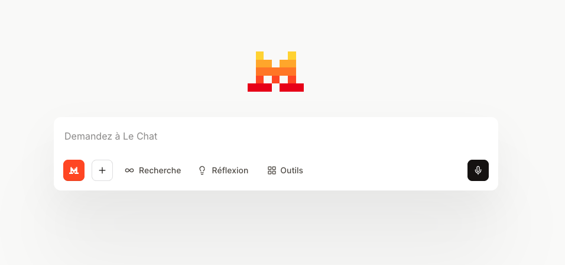
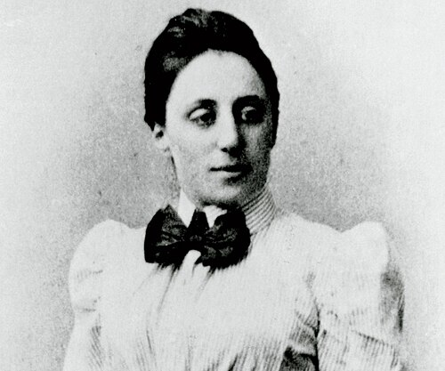
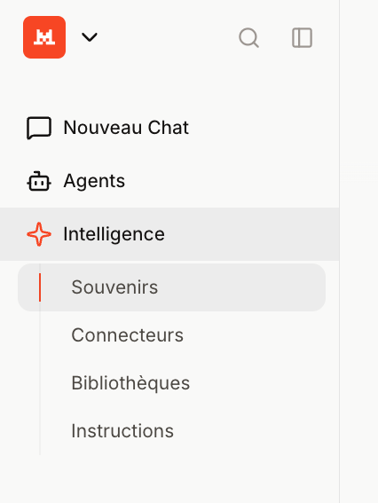

# Emmy, l'assistant IA du CNRS
## Une approche pratique

#### 19-03-2026, Thomas Vuillaume


<div class="brand-bar">
<br>
<br>
*Emmy a été utilisé dans la préparation de cette présentation
</div>

---

# Cette présentation

## Une approche pratique pour les non pratiquants

Ce dont je ne parlerai pas:

- comment les modèles de languages sont entrainés / fonctionnent
- la génération de code / aide au développement logiciel[^*]
- les questions éthiques et environmentales


De **très vastes** sujets sur lesquels je serais ravi de discuter à un autre moment / une autre présentation, si ca vous intéresse.


[^*]: un sondage est en cours sur l'utilisation des outils IA à l'IN2P3 pour cet usage, voir mon mail du 16 mars - https://machine-learning.pages.in2p3.fr/llm-survey-2026/


--- 
layout: two-cols
layoutClass: gap-10
---

# Emmy, c'est quoi ?


Emmy est un assistant conversationnel d'IA mis à disposition par le CNRS pour aider ses agents sur des tâches courantes de lecture, rédaction, synthèse et recherche d'information.


<div class="inline-figure mt-4">
  
</div>


- Une interface de chat
- Des échanges question/réponse
- La possibilité de joindre des documents


::right::

<div class="inline-figure mt-4">
  
  <p class="figure-caption">Emmy Noether (1882–1935), mathématicienne allemande pionnière en algèbre abstraite.</p>
</div>


---

# Pourquoi le CNRS a mis en place Emmy

<div class="grid grid-cols-2 gap-6 mt-6">
  <div class="panel">
    <h3>Répondre à un besoin réel</h3>
    <ul>
      <li>Les agents utilisent déjà des outils génératifs</li>
      <li>Les besoins sont très transverses dans les laboratoires</li>
      <li>Peut venir en aide sur des tâches très chronophages</li>
    </ul>
  </div>
  <div class="panel">
    <h3>Réduire les risques</h3>
    <ul>
      <li>Limiter le recours à des services externes non validés</li>
      <li>Mieux protéger les données et documents de travail</li>
      <li>Encadrer l'usage via une charte et une formation</li>
    </ul>
  </div>
</div>


---

# Comment y accéder 

<div class="text-center mt-8">

## https://emmy.cnrs.fr/

</div>

- [ ] J'ai suivi le module de sensibilisation 

- [ ] J'ai pris connaissance des [conditions d'utilisation](https://emmy.cnrs.fr/files/Conditions_utilisation_emmy.pdf), en particulier:
  - ne pas utiliser le système de notation des réponses fournies par l’outil (👍/👎), ni le centre de support de Mistral
  - ne pas partager de données sensibles (données personnelles, secret défense, industriel, commercial, pouvant porter atteinte aux intérêts de la nation...)
  - respecter les droits de propriété intellectuelle
  - procéder à une relecture critique du contenu généré
  - mentionner l'utlisation d'Emmy dans tout contenu généré par celui-ci
  - en faire usage avec discernement et parcimonie en particulier en raison de son impact environnemental


---

# À quoi ça sert concrètement ?

<div class="grid grid-cols-3 gap-4 mt-6 text-sm">
  <div class="feature-card">
    <h3>Synthétiser</h3>
    <p>Résumer un article, un compte rendu, un appel à projets.</p>
  </div>
  <div class="feature-card">
    <h3>Reformuler</h3>
    <p>Rendre un texte plus clair, plus court, plus diplomatique ou plus structuré.</p>
  </div>
  <div class="feature-card">
    <h3>Structurer</h3>
    <p>Aider à organiser des idées, des arguments, un plan ou une note.</p>
  </div>
  <div class="feature-card">
    <h3>Recherches complexes sur le web</h3>
    <p>Compiler de nombreuses sources.</p>
  </div>
  <div class="feature-card">
    <h3>Lire des contenus</h3>
    <p>Extraire du texte ou décrire des éléments à partir de documents ou d'images.</p>
  </div>
  <div class="feature-card">
    <h3>Expliquer</h3>
    <p>Expliquer un texte complexe ou comportant un jargon spécifique.</p>
  </div>
</div>


---

# Ce qu'Emmy ne fait pas

<div class="grid grid-cols-2 gap-8 mt-6">
  <div class="panel panel-warn">
    <h3>Il ne garantit pas la vérité</h3>
    <ul>
      <li>Il peut se tromper</li>
      <li>Il peut oublier un point important</li>
      <li>Il peut produire une réponse convaincante mais fausse</li>
    </ul>
  </div>
  <div class="panel panel-warn">
    <h3>Il ne remplace pas</h3>
    <ul>
      <li>La validation scientifique / technique / experte</li>
      <li>La responsabilité de l'auteur</li>
    </ul>
  </div>
</div>

<div class="panel panel-soft mt-8">
=> Plus l'enjeu est élevé, plus la vérification humaine doit être forte.
</div>

<div>
<br>
<br>
</div>

> Voyez le comme un gentil stagiaire:

> Bien cadré et avec toute l'information nécessaire, il peut faire du très bon boulot et vous faire gagner beaucoup de temps. 

---
layout: center
class: text-center
---

# En pratique

---

# Un peu de jargon

- **Assistant IA / chatbot**: une interface qui répond en langage naturel. Exemple: lechat (@Mistral)
- **Modèle de langage**: le moteur qui produit du texte. Exemple: Ministral
- **Prompt**: la consigne donnée par l'utilisateur
- **Outil**: une fonction externe que le modèle peut appeler (web, fichiers, calcul, etc.) pour agir au-delà du simple texte
- **Agent**: une configuration spécialisée de l'assistant (rôle + objectifs + règles), parfois capable d'enchaîner plusieurs actions
- **Instructions / Pre-prompt**: des consignes fixées en amont par l'organisation ou l'utlisateur pour cadrer le comportement de l'assistant

---

# Outils disponibles 

- Recherche Web
- Canvas
- Génération d'images
- Interpréteur de code

# Modes disponibles

- rapide : suffisant pour la manipulation du texte
- Réflexion : pour les raisonnements appronfondis
- Recherche: Recherche, analyse et compilations de plusieurs sources
- Agents


---

# Comment mieux l'utiliser

> Plus vous donnerez de **contexte**, meilleures seront les réponses.

Le contexte peut venir:
- dans votre prompt
- dans les documents joints

---
layoutClass: gap-10
---

# Comment personnaliser Emmy


<div class="grid grid-cols-2 gap-8 mt-6">

<div>
Menu de gauche

<div class="inline-figure mt-4">
  
</div>
</div>

  <div>
    <h3>Intelligence</h3>
    <ul>
      <li><strong>Souvenirs</strong> – Mémoire des discussions passées</li>
      <li><strong>Instructions</strong> – Fixer des directives générales</li>
      <li><strong>Bibliothèques</strong> – Ajouter des ressources personnalisées par thématiques</li>
    </ul>
    <br>
    <h3>Agents</h3>
    <ul>
      <li><strong>Créer un agent personnalisé</strong><br>
      <span style="font-size: 0.9em">Configuration spécialisée avec instructions et bibliothèques propres</span></li>
    </ul>
  </div>

</div>

---

# Scénario 1 : reformuler un mail

1.
```
Reformule cet email pour qu'il soit professionnel et courtois 
tout en restant ferme sur l'urgence. 
Ajoute une demande de confirmation de délai de livraison.

"Bonjour, je vous contacte car notre commande 
passée il y a 3 semaines n'est toujours pas arrivée. 
C'est inadmissible, le chercheur attend ce réactif pour 
ses expériences. Merci de régler ce problème rapidement."
```

2.
```
Maintenant traduis et adapte ce mail en anglais 
ton professionnel
```

---

# Scénario 2 : Notes de réunion

```text {*}{maxHeight: '250px'}
Notes Conseil de Labo LAPP - 18/03/2026

- notif CNRS reçue. enveloppe base stable mais +15% elec ! - impacte factures fluides
- ANR DarkMatter Explorer accordée - 250k/ 3 ans - lignes budget à ouvrir avant fin de mois (urgent gestion)
- budget usmb - attente virement 2e tranche
- achat oscillo ATLAS ok (devis Léman Sci reçu) -> Dir doit signer le BC

RH:
- départ Martine - retraite fin juin -> concours NOEMI ou CDD à lancer asap (secrétariat va être sous tension)
- 2 postdocs LSST arrivent en sept - bat 3 complet. où les mettre ? réaménager open space ou local archives ? 
- concours chercheurs : classement envoyé Paris.

Sécurité / Travaux :
- fuite azote hall montage. J-Marc s'en occupe (detecteurs à recalibrer d'ici vendredi)
- exercice incendie S15. personne n'est au courant (test réel)
- isolation toit bat principal cet été. bruit + parking A fermé !! -> faut prévenir tout le monde
- machine café HS (prestataire passe demain matin)

Divers :
- fête science oct : besoin volontaires chambre à brouillard. deadline avril.

Actions :
- Marie : check crédits ANR
- Service tech : balisage parking pour travaux été
```

Prompt:

```
Voici mes notes brutes du Conseil de Labo. 
Rédige un compte-rendu officiel, structuré et professionnel. 
Utilise des titres clairs, corrige les abréviations, 
et génère en fin de document un tableau récapitulatif des actions avec les responsables et les échéances.
```


--- 

# Scénario 3 : Structurer des informations non structurées

``` {*}{maxHeight: '200px'}
Bonjour l'équipe du LAPP,

Suite à nos échanges, voici notre meilleure offre pour le matériel d'acquisition que vous avez demandé pour votre manip.
On peut vous faire l'oscilloscope 4 voies 5GHz (réf TEK-5G-4V) à 14 500 € HT l'unité. Pour les cartes d'acquisition rapides PCIe (ACQ-PCIE-10G), il en fallait deux c'est bien ça ? Elles sont à 3 200 € HT pièce. 
J'ai rajouté les 10 câbles SMA (réf CAB-SMA-2M) pour 450 euros HT l'ensemble (soit 45€/unité). On vous offre pas les frais de port cette fois car le matériel est lourd, il faut compter 150 € HT pour la livraison sécurisée.
Total HT : 21 500,00 Euros.
TVA à 20% : 4300,00 €.
Ce qui nous fait un total TTC de 25 800,00 Euros.
Le devis D-2026-03-014 est valable 1 mois. On accepte le paiement par Chorus Pro à 30 jours comme d'habitude avec le CNRS. Pour les délais, comptez environ 5 semaines.

Bien cordialement,
Jean-Pierre
Léman Scientifique Instruments
14 Ave des Pâturages, 74000 Annecy
SIRET 88412345600012
```

Prompt:
```
Analyse ce devis. Extrais les informations suivantes sous forme de tableau :
Nom du fournisseur, Date de validité, Référence de chaque article, Prix unitaire HT, Nombre d'articles, Montant Total HT, Montant de la TVA, et Montant total TTC. 
Ce tableau doit être prêt à être copié dans Excel.
```
---

# Scénario 4 : Extraire des informations d'un document long et complexe

Uploader le document instructions missions CNRS

```text
Peux-tu me faire un tableau récapitulatif des plafonds d'hôtels par zone géographique 
```


---

# Scénario 5 : aide sur fichier excel

1. Uploader document excel

2. 
```
donne moi une formule pour additionner les montants 
concernant uniquement le fournisseur "Sigma-Aldrich" sur ce fichier
```

3. 
```
fait moi un graphique de l'évolution du montant cumulé en fonction de la date
```

---

# Scénario 6 : aide sur la création d'un nouveau tableur

Prompt:

```
Je suis gestionnaire dans un laboratoire CNRS,
je veux créer un nouveau fichier Excel pour suivre les commandes du labo. 
Je voudrais que tu m'aides à ne pas oublier une colonne dans ce tableur.

Pose-moi une série de questions une par une pour m'aider à définir ce qu'il faut mettre dans ce fichier. 
```

<!--
passer si trop long
-->

---

# Scénario 7 : Revue / Recherche complexe   


```text {*}{maxHeight: '200px'}
Effectue une recherche approfondie sur les procédures actuelles 
pour l'accueil d'un chercheur indien en France en 2026 (Visa Passeport Talent - Chercheur).

1. Quelles sont les étapes précises pour la Convention d'Accueil avec le CNRS ?
2. Quels sont les délais actuels constatés pour l'obtention du visa 'Passeport Talent - Famille' ? 
3. Liste les aides à l'installation (logement, CAF, sécurité sociale) spécifiques pour les scientifiques étrangers arrivant en Haute-Savoie (Réseau Euraxess ou équivalent).
4. Vérifie s'il y a eu des changements récents dans la loi immigration concernant le cautionnement du retour pour les chercheurs."
```

Utilisation de la recherche approfondie:
https://chat.mistral.ai/chat/baa02390-e3f6-47e0-932b-189f7a6ba397


---
layout: center
class: text-center
---

# Questions ?

<style>
:root {
  --cnrs-navy: #0d2440;
  --cnrs-blue: #1c5fa8;
  --cnrs-cyan: #8fd3dc;
  --cnrs-sand: #f6f1e8;
  --cnrs-orange: #ef8f52;
  --cnrs-red: #d45c4a;
  --cnrs-ink: #132033;
}

.slidev-layout {
  background:
    radial-gradient(circle at 15% 15%, rgba(143, 211, 220, 0.22), transparent 28%),
    radial-gradient(circle at 85% 20%, rgba(239, 143, 82, 0.16), transparent 24%),
    linear-gradient(180deg, #fbf8f2 0%, #f3ede2 100%);
  color: var(--cnrs-ink);
}

.slidev-layout.cover,
.slidev-layout.center,
.slidev-layout.end {
  background:
    radial-gradient(circle at 20% 15%, rgba(143, 211, 220, 0.18), transparent 24%),
    radial-gradient(circle at 80% 75%, rgba(239, 143, 82, 0.16), transparent 28%),
    linear-gradient(135deg, #081a31 0%, #12355d 52%, #1e4d7f 100%);
  color: #f9f6ef;
}

.slidev-layout h1,
.slidev-layout h2,
.slidev-layout h3 {
  color: inherit;
}

.brand-bar {
  display: inline-block;
  padding: 0.35rem 0.8rem;
  border: 1px solid rgba(249, 246, 239, 0.35);
  border-radius: 999px;
  letter-spacing: 0.08em;
  text-transform: uppercase;
  font-size: 0.7rem;
  opacity: 0.88;
}

.hero-subtitle {
  font-size: 1.05rem;
  opacity: 0.88;
}

.hero-grid {
  display: grid;
  grid-template-columns: repeat(3, minmax(0, 1fr));
  gap: 0.9rem;
}

.hero-card,
.panel,
.feature-card,
.tip-card,
.stat-box,
.takeaway {
  border-radius: 1rem;
  backdrop-filter: blur(6px);
}

.hero-card {
  padding: 1rem;
  border: 1px solid rgba(249, 246, 239, 0.18);
  background: rgba(249, 246, 239, 0.08);
  text-align: left;
}

.hero-kicker {
  font-size: 0.72rem;
  text-transform: uppercase;
  letter-spacing: 0.08em;
  opacity: 0.7;
  margin-bottom: 0.35rem;
}

.hero-copy {
  font-size: 0.96rem;
  line-height: 1.35;
}

.hero-orb {
  position: absolute;
  border-radius: 999px;
  filter: blur(18px);
  opacity: 0.35;
}

.hero-orb-a {
  width: 12rem;
  height: 12rem;
  left: 4%;
  bottom: 10%;
  background: var(--cnrs-cyan);
}

.hero-orb-b {
  width: 10rem;
  height: 10rem;
  right: 8%;
  top: 18%;
  background: var(--cnrs-orange);
}

.callout,
.panel,
.feature-card,
.tip-card,
.stat-box,
.takeaway {
  background: rgba(255, 255, 255, 0.7);
  border: 1px solid rgba(13, 36, 64, 0.08);
  box-shadow: 0 10px 40px rgba(13, 36, 64, 0.08);
}

.slidev-layout.cover .callout,
.slidev-layout.center .takeaway,
.slidev-layout.center .tip-card {
  background: rgba(249, 246, 239, 0.1);
  border-color: rgba(249, 246, 239, 0.15);
  box-shadow: none;
}

.callout,
.panel,
.stat-box,
.takeaway {
  padding: 1rem 1.1rem;
}

.panel h3,
.feature-card h3,
.tip-card h3 {
  margin-top: 0;
}

.panel-warn {
  background: rgba(212, 92, 74, 0.08);
  border-color: rgba(212, 92, 74, 0.18);
}

.panel-soft,
.stat-box.soft {
  background: rgba(28, 95, 168, 0.07);
  border-color: rgba(28, 95, 168, 0.14);
}

.feature-card,
.tip-card {
  padding: 1rem;
  min-height: 9rem;
}

.stats-row {
  display: grid;
  grid-template-columns: repeat(3, minmax(0, 1fr));
  gap: 1rem;
}

.stat-value {
  font-size: 1.5rem;
  font-weight: 700;
  color: var(--cnrs-blue);
}

.stat-label {
  margin-top: 0.35rem;
  font-size: 0.86rem;
  line-height: 1.35;
}

.takeaways {
  display: grid;
  grid-template-columns: 1fr;
  gap: 0.9rem;
}

.takeaway {
  font-size: 1.1rem;
  line-height: 1.35;
}

.footnote {
  margin-top: 1rem;
  font-size: 0.85rem;
  opacity: 0.7;
}

.inline-figure {
  display: flex;
  flex-direction: column;
  align-items: center;
}

.figure-caption {
  margin-top: 0.5rem;
  font-size: 0.75rem;
  line-height: 1.4;
  opacity: 0.65;
  text-align: center;
  font-style: italic;
  max-width: 22rem;
}

.inline-figure-image {
  display: block;
  max-width: 100%;
  max-height: 14rem;
  border-radius: 0.9rem;
  border: 1px solid rgba(13, 36, 64, 0.12);
  box-shadow: 0 10px 30px rgba(13, 36, 64, 0.12);
  object-fit: contain;
}

@media (max-width: 900px) {
  .hero-grid,
  .stats-row {
    grid-template-columns: 1fr;
  }
}
</style>