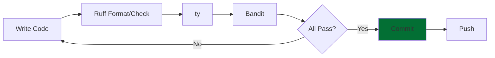

# Quality Tools for Research Software

## Practical tools for ensuring code quality in 2026 with a bias on Python

<div class="pt-12">
  <span @click="$slidev.nav.next" class="px-2 py-1 rounded cursor-pointer" hover:bg="white op-10">
    Press Space for next page <carbon:arrow-right class="inline"/>
  </span>
</div>

<div class="abs-tl m-6 flex">
  
</div>

<div class="abs-br m-6 flex gap-2">
  <a href="https://everse.software/RSQKit/" target="_blank" alt="RSQKit" title="Open RSQKit"
    class="text-xl slidev-icon-btn opacity-50 !border-none !hover:text-white">
    <carbon:logo-github />
  </a>
</div>

<!--
Welcome to this lecture on quality tools for research software. We'll cover quality dimensions, Python tools, and testing practices.
-->

---
layout: two-cols
layoutClass: gap-16
---

# Lecture Overview

**Duration:** 60 minutes  
**Target Audience:** Research software developers, PhD students, postdocs, researchers

::right::

## Topics

1. What are Quality Tools ?
2. A few recommended ones
2. Hands-on Exercises

**Learning Outcomes:**
- Apply Python quality tools (linters, type checkers, security scanners)
- Configure tools for your projects
- Integrate tools into development workflow

<!--
This lecture focuses on practical tools and techniques for ensuring quality in your research software.
-->


---
layout: center
class: text-center
---


# Quality Tools ?

---
level: 2
---

# Why Quality Tools?

<div class="grid grid-cols-2 gap-8">

<div> 

<div v-click>

## Benefits

- 🤖 **Automate** bug detection
- 📏 **Enforce** consistency
- 📖 **Improve** readability
- 🔒 **Detect** security issues
- ⚡ **Accelerate** development
- 🧪 **Support** testing practices

</div>

</div>

<div v-click>

## Categories

1. **Linters/Formatters** - Style & formatting
2. **Type Checkers** - Static type analysis
3. **Security Scanners** - Vulnerability detection
4. **Complexity Analyzers** - Code complexity metrics
5. **Documentation Checkers** - Doc quality

</div>

</div>

<div v-click class="mt-6 p-4 bg-blue-50 dark:bg-blue-900 rounded">
💡 Tools should integrate in your workflow to automate quality checks
</div>

<!--
Quality tools make it easy to maintain high standards without manual code review for every detail.
-->

---
level: 2
zoom: 0.95
---

# Static vs Dynamic Analysis

<div class="grid grid-cols-2 gap-8">

<div>

## Static Analysis

<div v-click>


**Analyze code without running it**<br>
**=> Fast !**

</div> 

<div v-click>

### How It Works
- Read and parse source code
- Apply rules and patterns
- No execution needed
- Fast feedback loop

</div>

<div v-click>

### What It Checks
- Code style violations
- Type errors
- Security vulnerabilities
- Potential bugs

</div>

</div>

<div>

## Dynamic Analysis

<div v-click>

**Analyze code while running it**<br>
**=> Slower but more in depth**

</div>

<div v-click>

### How It Works
- Execute the program
- Monitor behavior at runtime
- Test execution paths
- Measure performance

### What It Checks
- Logic errors
- Runtime failures
- Performance bottlenecks
- Memory leaks
- Integration issues

</div>

</div>

</div>

<div v-click class="mt-6 p-4 bg-blue-50 dark:bg-blue-900 rounded text-center">
✋ Some examples you have already used?
</div>

<!--
Static analysis tools find potential issues without running code. Dynamic analysis (testing) ensures your code actually works as intended. Both are essential for quality.
-->

---
level: 2
---

# Category 1: Linters and Formatters

<div class="grid grid-cols-2 gap-8">

<div>

## What are Linters?

<div v-click>

Tools that analyze code for:
- **Style violations** (PEP 8)
- **Potential bugs**
- **Code smells**
- **Best practice violations**

</div>
<div v-click>

Popular Python Linters
- **Ruff** ⭐ 
- Flake8 (classic)
- Pylint (comprehensive)

</div>

</div>

<div>

## What are Formatters?

<div v-click>

Tools that automatically fix formatting:
- **Consistent style**
- **Readable code**
- **No manual formatting**

</div>
<div v-click> 

Popular Python Formatters
- **Ruff** ⭐
- Black (opinionated)
- autopep8 (PEP 8 focused)

</div>

</div>

</div>

<div v-click class="mt-4 p-3 bg-green-50 dark:bg-green-900 rounded text-sm">
💡 Ruff combines both linting and formatting in one fast tool!
</div>

<!--
Linters find issues, formatters fix them automatically. Ruff does both and is extremely fast.
-->

---
level: 2
zoom: 0.75
---

# Ruff: Ultra-Fast Python Linter & Formatter


<div class="grid grid-cols-2 gap-8">

<div>

## What is Ruff?

<div v-click>

- Written in **Rust** (10-100x faster)
- Replaces **Flake8, Black, isort...**
- Supports **700+ rules**
- Auto-fixes many issues

</div>

<div v-click class="mt-4">

### Installation

```bash
pip install ruff / pixi add ruff
```
or 

> IDE integration (e.g. VScode extension)

</div>

<div v-click class="mt-4">

### Basic Usage

```bash
# Check for issues
ruff check .

# Auto-fix issues
ruff check --fix .

# Format code
ruff format .
```

</div>

</div>

<div v-click>

## Example configuration 

`pyproject.toml` / `ruff.toml` (auto-read when running ruff)
```toml
[tool.ruff]
# Exclude common directories
exclude = [
    ".pixi",
    "__pycache__",
]

# Line length
line-length = 99

# Enable specific rule sets
select = [
    "E",   # pycodestyle errors
    "W",   # pycodestyle warnings
    "F",   # pyflakes errors
    "I",   # isort
    "B",   # flake8-bugbear
    "C4",  # flake8-comprehensions
]

[tool.ruff.rules]
D = true  # enable pydocstyle-like docstring checks

# Per-file ignores: override rules for notebooks
per-file-ignores = { 
    "notebooks/*.py" = ["E501"]  # ignore line length in notebooks
}
```

</div>

</div>

<div class="abs-br m-6 text-sm opacity-50">
Source: ruff.rs
</div>

<!-- 
Ruff is the modern choice for Python linting and formatting. It's incredibly fast and replaces multiple tools.
-->

---
---

# Exercise : Try Ruff yourself (5')

1. Go back to `pkoffee`
2. Add ruff to your pixi environment
3. run ``ruff check .``
  - see if there are issues
  - understand them
  - try and fix them with `ruff check . --fix` or manually
4. run `ruff format .`
5. (Optional) Install the ruff extension for your IDE
    - mess with a file (e.g. remove spaces in a function variables definition)
    - save
    - watch instant formatting

---
level: 2
---

# Category 2: Type Checkers

## What is Type Checking?

<v-clicks>

Static analysis of type hints:

```python
def add(a: int, b: int) -> int:
    return a + b

# Type checker catches this:
result = add("hello", 5)  # Error!
```

### Benefits
- Catch bugs before runtime
- Better IDE support
- Self-documenting code
- Safer refactoring

</v-clicks>


---
zoom: 0.8
---

# ty: Static Type Checker


<div class="grid grid-cols-2 gap-8">

<div>

## What is ty?

<div v-click>

- **Fast, Rust-based type checker** for Python (much faster than `mypy`).
- **Rule-based configuration**: set severity per type of check (`error`, `warn`, `ignore`).
- **Inline suppressions**: `# ty: ignore[...]` for fine-grained control.
- **CLI and IDE integration** (e.g. VSCode extension)


</div>

<div v-click class="mt-4">

### Installation

<div class="grid grid-cols-2 gap-4">
```bash
pip install ty
```
```bash
pixi add ty
```
</div>
or 

> IDE integration (e.g. VScode extension)

</div>

<div v-click class="mt-4">

### Basic Usage

Check a directory:
```bash
ty check src/
```

</div>

</div>

<div v-click>

## Example configuration 

`pyproject.toml` / `ty.toml` (auto-read when running ruff)
```toml
[tool.ty]
include = ["your_package/", "src/"]
exclude = ["tests/", "data/", "notebooks/"]

[tool.ty.rules]
# treat missing imports as errors
possibly-missing-import = "error"
# unused ignore comments are warnings
unused-ignore-comment = "warn"
```

</div>

</div>

<div class="abs-br m-6 text-sm opacity-50">
Source: https://docs.astral.sh/ty
</div>

<!--
Type checking helps catch bugs early. Start gradually and add more strictness over time.
-->

---

# Exercise : try ty

In `pkoffee`

1. Install ty
2. Add config to `pyproject.toml`
3. Run `ty check`

---
level: 2
---

# Category 3: Security Scanners

<div class="grid grid-cols-2 gap-4">
<div v-click>

## Tools can detect:
- **Hardcoded secrets** (passwords, API keys)
- **SQL injection** vulnerabilities
- **Insecure functions** (eval, pickle)
- **Weak cryptography**
- **Path traversal** issues
</div>

<div v-click>

## Why It Matters
- Protect sensitive data
- Prevent security breaches
- Meet compliance requirements
- Build trust

</div>
</div>
---
level: 2
---

# Bandit: Security Scanner

<div class="grid grid-cols-2 gap-4">

<div v-click>

### Installation

<div class="grid grid-cols-2 gap-4">
```bash
pip install bandit
```
```bash
pixi add bandit
```
</div>
or 

> Use with [IDE integration](https://bandit.readthedocs.io/en/latest/integrations.html).


<div v-click>

### Usage
```bash
# Scan a directory
bandit -r your_package/

# Generate detailed report in JSON format
bandit -r your_package/ -f json -o report.json

# Ignore specific tests
bandit -r . -s B101,B601

# Pass a confif
bandit -r . -c bandit.toml
```
</div>
</div>

<div v-click>

### Example of issues
- B105: Hardcoded password
- B301: Use of pickle (unsafe)
- B614: Unsafe use of pytorch load

[Complete list](https://bandit.readthedocs.io/en/latest/plugins/index.html#complete-test-plugin-listing)
</div>

</div>

<div class="abs-br m-6 text-sm opacity-50">
Source: PyCQA/bandit
</div>

<!--
Security scanning is critical for research software handling sensitive data or user inputs.
-->

---
zoom: 0.85
---

# Dependabot: Automated Dependency Updates

<div class="grid grid-cols-2 gap-8">

<div>

## What is Dependabot?

<v-clicks>

- **GitHub-native** tool (free for all repos)
- Automatically **monitors dependencies**
- Creates **pull requests** for updates
- Detects **security vulnerabilities**
- Supports multiple ecosystems (Python, npm, Docker, etc.)

<div v-click class="mt-4 p-3 bg-red-50 dark:bg-red-900 rounded">
⚠️ pixi.toml not supported yet :(
</div>

</v-clicks>

<div v-click class="mt-4">

### Key Features
- Security alerts for known CVEs
- Version updates (major, minor, patch)
- Automatic PR creation
- Configurable update schedule
- Grouping related updates

</div>

</div>

<div v-click>

## Configuration 

`.github/dependabot.yml`

```yaml
version: 2
updates:
  # Python dependencies
  - package-ecosystem: "pip"
    directory: "/"
    schedule:
      interval: "weekly"
      day: "monday"
    open-pull-requests-limit: 5
    labels:
      - "dependencies"
      - "python"
    reviewers:
      - "your-team"
    
  # GitHub Actions
  - package-ecosystem: "github-actions"
    directory: "/"
    schedule:
      interval: "monthly"
```

</div>

</div>

<div v-click class="mt-4 p-3 bg-green-50 dark:bg-green-900 rounded">
💡 Exercise: <a href=https://docs.github.com/en/code-security/tutorials/secure-your-dependencies/dependabot-quickstart-guide>Enable Dependabot</a> in your pkoffee repository security settings for auto vulnerability fixes!
</div>

<!--
Dependabot automates the tedious task of keeping dependencies up to date and secure. It's especially valuable for research software that may not be actively maintained but still needs security updates.
-->

---
zoom: 0.8
---

# Additional Useful Tools

<div class="grid grid-cols-2 gap-6 text-sm">

<div>

<v-click>

## pip-audit
Check for known vulnerabilities in dependencies.
- Works locally or in CI.
- Fails builds if vulnerable packages are present.

<div class="grid grid-cols-2 gap-6 text-sm">

```bash
pip install pip-audit
```
```bash
pixi add pip-audit
```
</div>
```bash
pip-audit
```
</v-click>

<v-click>

## interrogate
Measure docstring coverage

<div class="grid grid-cols-2 gap-6 text-sm">

```bash
pip install interrogate
```
```bash
pixi add interrogate
```
</div>
```bash
interrogate -v your_package/
```

</v-click>

</div>
<div>

<v-click>

## hadolint: Dockerfile Linting

Linter for Dockerfiles - checks best practices, security, and efficiency.

See [their repository](https://github.com/hadolint/hadolint) for installation instructions (depends on your system).

Usage:
```bash
# Lint a Dockerfile
hadolint Dockerfile

# Ignore specific rules
hadolint --ignore DL3008 Dockerfile
```

**Common checks:**
- Base image pinning
- Layer optimization
- Security best practices
- COPY vs ADD usage

</v-click>

</div>

<div>


</div>
</div>

---
zoom: 0.8
---


## Pre-commit Hooks

Run tools automatically before commits

<v-click>

```bash
pip install pre-commit
pre-commit install
```

</v-click>

<div v-click>

Config example `.pre-commit-config.yaml`:
```yaml {*}{maxHeight:'500px'}
repos:
-   repo: https://github.com/pre-commit/pre-commit-hooks
    rev: v6.0.0 
    hooks:
    -   id: trailing-whitespace
    -   id: check-added-large-files
    - id: actionlint
      name: Lint GitHub Actions workflow files
      description: Runs actionlint to lint GitHub Actions workflow files
      language: golang
      types: ["yaml"]
      files: ^\.github/workflows/
      entry: actionlint
      minimum_pre_commit_version: 3.0.0
  - repo: https://github.com/astral-sh/ruff-pre-commit
    rev: v0.1.0
    hooks:
      - id: ruff
      - id: ruff-format
  - repo: https://github.com/gitleaks/gitleaks
    rev: v8.24.2
    hooks:
      - id: gitleaks
```

</div>


<!--
These additional tools complete your quality toolbox. Pre-commit hooks ensure quality before code is committed.
-->

---
level: 2
---

# Putting It All Together: Quality Workflow

<div class="text-center mb-6">



</div>

<div class="grid grid-cols-2 gap-6 text-sm">

<div v-click>

## Local Development

1. Write code
2. Format with `ruff format`
3. Lint with `ruff check --fix`
4. Type check with `ty`
5. Security scan with `bandit`
6. Commit if all pass

</div>

<div v-click>

## Automation Options

- **Pre-commit hooks** - Run before each commit
- **IDE integration** - Real-time feedback or fix
- **CI/CD** - Prevents from merging code not following repository standards or rules

</div>

<v-click>

<div class="mt-3 p-3 bg-blue-50 dark:bg-blue-900 rounded">
💡 Start manually, then add automation as you get comfortable
</div>

</v-click>

</div>


<!--
A good workflow combines multiple tools for comprehensive quality checks. Automate as much as possible.
-->

---
level: 2
layout: two-cols
---

# Exercise

- add `ruff` check to your CI/CD
- add `interrogate` to your CI/CD


<div class="mt-3 text-xs opacity-70">
💡 Use GitHub actions marketplace 
</div>

<!--
Live demo showing how each tool finds different types of issues. Fix them one by one.
-->

---
level: 2
layout: two-cols
---

# Exercise: Add badges to your README

## Tasks


<div class="mt-3 text-xs opacity-70">
⏱️ 15 minutes hands-on exercise
</div>


<!--
Participants will apply all tools to fix a project with intentional issues. Instructors circulate to help.
-->

---

# Resources and Further Learning

<div class="grid grid-cols-2 gap-6 text-sm">

<div>

## Documentation

- [Ruff Documentation](https://docs.astral.sh/ruff/)
- [mypy Documentation](https://mypy.readthedocs.io/)
- [Bandit Documentation](https://bandit.readthedocs.io/)
- [pre-commit](https://pre-commit.com/)

## EVERSE

- [EVERSE Project](https://everse.software/)
- [RSQKit   ](https://everse.software/RSQKit/)
- [Quality Dimensions](https://everse.software/indicators/website/dimensions.html)
- [EVERSE TechRadar](https://everse.software/TechRadar/)

</div>

<div>

## Tools & Guides

- [Ruff Rules](https://docs.astral.sh/ruff/rules/)
- [mypy Type Hints Cheat Sheet](https://mypy.readthedocs.io/en/stable/cheat_sheet_py3.html)
- [PEP 8 Style Guide](https://peps.python.org/pep-0008/)
- [Python Type Hints](https://docs.python.org/3/library/typing.html)

## Community

- [EVERSE Network](https://everse.software/network/)
- [Research Software Engineers (RSE)](https://society-rse.org/)
- [Software Carpentry](https://software-carpentry.org/)

</div>

</div>

<div class="mt-8 text-center">

### Questions?

thomas.vuillaume@lapp.in2p3.fr

</div>

<div class="abs-br m-6 text-sm opacity-50">
Thank you!
</div>

<!--
These resources will help you continue learning about quality tools and best practices.
-->
