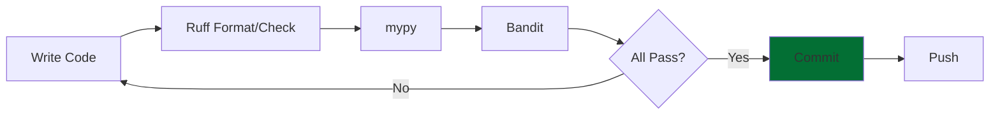

# Quality Tools for Research Software

Practical Python tools for ensuring code quality

<div class="pt-12">
  <span @click="$slidev.nav.next" class="px-2 py-1 rounded cursor-pointer" hover:bg="white op-10">
    Press Space for next page <carbon:arrow-right class="inline"/>
  </span>
</div>

<div class="abs-br m-6 flex gap-2">
  <a href="https://everse.software/RSQKit/" target="_blank" alt="RSQKit" title="Open RSQKit"
    class="text-xl slidev-icon-btn opacity-50 !border-none !hover:text-white">
    <carbon:logo-github />
  </a>
</div>

<!--
Welcome to this lecture on quality tools for research software. We'll cover quality dimensions, Python tools, and testing practices.
-->

---
layout: two-cols
layoutClass: gap-16
---

# Lecture Overview

**Duration:** 60 minutes  
**Target Audience:** Research software developers, PhD students, postdocs, researchers

::right::

## Topics

1. What are Quality Tools ?
2. A few recommended ones
2. Hands-on Exercises

**Learning Outcomes:**
- Apply Python quality tools (linters, type checkers, security scanners)
- Configure tools for your projects
- Integrate tools into development workflow

<!--
This lecture focuses on practical tools and techniques for ensuring quality in your research software.
-->


---
layout: center
class: text-center
---


# Quality Tools ?

---
level: 2
---

# Why Quality Tools?

<div class="grid grid-cols-2 gap-8">

<div>

## Benefits

<v-clicks>

- 🤖 **Automate** bug detection
- 📏 **Enforce** consistency
- 📖 **Improve** readability
- 🔒 **Detect** security issues
- ⚡ **Accelerate** development
- 🧪 **Support** testing practices

</v-clicks>

</div>

<div v-after>

## Categories

1. **Linters/Formatters** - Style & formatting
2. **Type Checkers** - Static type analysis
3. **Security Scanners** - Vulnerability detection
4. **Complexity Analyzers** - Code complexity metrics
5. **Documentation Checkers** - Doc quality

</div>

</div>

<div v-click class="mt-6 p-4 bg-blue-50 dark:bg-blue-900 rounded">
💡 Tools should integrate in your workflow to automate quality checks
</div>

<!--
Quality tools make it easy to maintain high standards without manual code review for every detail.
-->

---
level: 2
---

# Static vs Dynamic Analysis

<div class="grid grid-cols-2 gap-8">

<div>

## Static Analysis

**Analyze code without running it**<br>
**= Fast !**

<v-clicks>

### How It Works
- Read and parse source code
- Apply rules and patterns
- No execution needed
- Fast feedback loop

### What It Checks
- Code style violations
- Type errors
- Security vulnerabilities
- Potential bugs

</v-clicks>

</div>

<div>

## Dynamic Analysis

**Analyze code while running it**<br>
**= Slower but more in depth**

<v-clicks>

### How It Works
- Execute the program
- Monitor behavior at runtime
- Test execution paths
- Measure performance

### What It Checks
- Logic errors
- Runtime failures
- Performance bottlenecks
- Memory leaks
- Integration issues

</v-clicks>

</div>

</div>

<div v-click class="mt-6 p-4 bg-blue-50 dark:bg-blue-900 rounded text-center">
✋ Some examples you have already used?
</div>

<!--
Static analysis tools find potential issues without running code. Dynamic analysis (testing) ensures your code actually works as intended. Both are essential for quality.
-->

---
level: 2
---

# Category 1: Linters and Formatters

<div class="grid grid-cols-2 gap-8">

<div>

## What are Linters?

<v-clicks>

Tools that analyze code for:
- **Style violations** (PEP 8)
- **Potential bugs**
- **Code smells**
- **Best practice violations**

### Popular Python Linters
- **Ruff** ⭐ (modern, ultra-fast)
- Flake8 (classic)
- Pylint (comprehensive)

</v-clicks>

</div>

<div>

## What are Formatters?

<v-clicks>

Tools that automatically fix formatting:
- **Consistent style**
- **Readable code**
- **No manual formatting**

### Popular Python Formatters
- **Ruff** ⭐ (linter + formatter)
- Black (opinionated)
- autopep8 (PEP 8 focused)

</v-clicks>

</div>

</div>

<div v-click class="mt-4 p-3 bg-green-50 dark:bg-green-900 rounded text-sm">
💡 Ruff combines both linting and formatting in one fast tool!
</div>

<!--
Linters find issues, formatters fix them automatically. Ruff does both and is extremely fast.
-->

---
level: 2
---

# Ruff: Ultra-Fast Python Linter & Formatter

<div class="grid grid-cols-2 gap-8">

<div>

## What is Ruff?

<v-clicks>

- Written in **Rust** (10-100x faster)
- Replaces **Flake8, Black, isort**
- Supports **700+ rules**
- Auto-fixes many issues

</v-clicks>

<div v-click class="mt-4">

### Installation


```bash
pip install ruff / pixi add ruff
```
or 

> IDE integration

</div>

<div v-click class="mt-4">

### Basic Usage

```bash
# Check for issues
ruff check .

# Auto-fix issues
ruff check --fix .

# Format code
ruff format .
```

</div>

</div>

<div v-click>

## Configuration (pyproject.toml)

```toml
[tool.ruff]
# Exclude common directories
exclude = [
    ".git",
    ".venv",
    "__pycache__",
]

# Line length
line-length = 88

# Enable specific rule sets
select = [
    "E",   # pycodestyle errors
    "W",   # pycodestyle warnings
    "F",   # pyflakes
    "I",   # isort
    "B",   # flake8-bugbear
    "C4",  # flake8-comprehensions
]

# Ignore specific rules
ignore = [
    "E501",  # line too long (handled by formatter)
]
```

</div>

</div>

<div class="abs-br m-6 text-sm opacity-50">
Source: ruff.rs
</div>

<!-- 
Ruff is the modern choice for Python linting and formatting. It's incredibly fast and replaces multiple tools.
-->

---
level: 2
---

# Category 2: Type Checkers

<div class="grid grid-cols-2 gap-8">

<div>

## What is Type Checking?

<v-clicks>

Static analysis of type hints:

```python
def add(a: int, b: int) -> int:
    return a + b

# Type checker catches this:
result = add("hello", 5)  # Error!
```

### Benefits
- Catch bugs before runtime
- Better IDE support
- Self-documenting code
- Safer refactoring

</v-clicks>

</div>

<div v-click>

## mypy: Static Type Checker


### Installation
```bash
pip install mypy
```

### Usage
```bash
# Check a file or directory
mypy your_package/

# Check with strict mode
mypy --strict your_package/
```

### Configuration (pyproject.toml)
```toml
[tool.mypy]
python_version = "3.10"
warn_return_any = true
warn_unused_configs = true
disallow_untyped_defs = true

# Per-module options
[[tool.mypy.overrides]]
module = "tests.*"
disallow_untyped_defs = false
```

</div>

</div>

<div class="abs-br m-6 text-sm opacity-50">
Source: mypy-lang.org
</div>

<!--
Type checking helps catch bugs early. Start gradually and add more strictness over time.
-->

---
level: 2
---

# Category 3: Security Scanners

<div class="grid grid-cols-2 gap-4">
<div v-click>

## Tools can detect:
- **Hardcoded secrets** (passwords, API keys)
- **SQL injection** vulnerabilities
- **Insecure functions** (eval, pickle)
- **Weak cryptography**
- **Path traversal** issues
</div>

<div v-click>

## Why It Matters
- Protect sensitive data
- Prevent security breaches
- Meet compliance requirements
- Build trust

</div>
</div>
---
level: 2
---

# Bandit: Security Scanner

<div class="grid grid-cols-2 gap-4">

<div v-click>

### Installation
```bash
pip install bandit
```
or 
```bash
pixi add bandit
```
or 

> Use as [IDE integration](https://bandit.readthedocs.io/en/latest/integrations.html).

<div v-click>

### Usage
```bash
# Scan a directory
bandit -r your_package/

# Generate detailed report in JSON format
bandit -r your_package/ -f json -o report.json

# Ignore specific tests
bandit -r . -s B101,B601

# Pass a confif
bandit -r . -c bandit.toml
```
</div>
</div>

<div v-click>

### Example of issues
- B105: Hardcoded password
- B201: Flask app with debug=True
- B301: Use of pickle (unsafe)
- B614: Unsafe use of pytorch load

[Complete list](https://bandit.readthedocs.io/en/latest/plugins/index.html#complete-test-plugin-listing)
</div>
</div>

<div class="abs-br m-6 text-sm opacity-50">
Source: PyCQA/bandit
</div>

<!--
Security scanning is critical for research software handling sensitive data or user inputs.
-->

---
level: 2
---

# Dependabot: Automated Dependency Updates

<div class="grid grid-cols-2 gap-8">

<div>

## What is Dependabot?

<v-clicks>

- **GitHub-native** tool (free for all repos)
- Automatically **monitors dependencies**
- Creates **pull requests** for updates
- Detects **security vulnerabilities**
- Supports multiple ecosystems (Python, npm, Docker, etc.)

<div v-click class="mt-4 p-3 bg-red-50 dark:bg-red-900 rounded">
⚠️ pixi.toml not supported yet :(
</div>

</v-clicks>

<div v-click class="mt-4">

### Key Features
- Security alerts for known CVEs
- Version updates (major, minor, patch)
- Automatic PR creation
- Configurable update schedule
- Grouping related updates

</div>

</div>

<div v-click>

## Configuration (.github/dependabot.yml)

```yaml
version: 2
updates:
  # Python dependencies
  - package-ecosystem: "pip"
    directory: "/"
    schedule:
      interval: "weekly"
      day: "monday"
    open-pull-requests-limit: 5
    labels:
      - "dependencies"
      - "python"
    # Auto-merge patch updates
    reviewers:
      - "your-team"
    
  # GitHub Actions
  - package-ecosystem: "github-actions"
    directory: "/"
    schedule:
      interval: "monthly"
```

</div>

</div>

<div v-click class="mt-4 p-3 bg-green-50 dark:bg-green-900 rounded">
💡 <a href=https://docs.github.com/en/code-security/tutorials/secure-your-dependencies/dependabot-quickstart-guide>Enable Dependabot</a> in your repository security settings for auto vulnerability fixes!
</div>

<!--
Dependabot automates the tedious task of keeping dependencies up to date and secure. It's especially valuable for research software that may not be actively maintained but still needs security updates.
-->

---
level: 2
---

# Additional Useful Tools

<div class="grid grid-cols-2 gap-6 text-sm">

<div>

## Dependency Security

<v-clicks>

### pip-audit
Check for known vulnerabilities in dependencies

```bash
pip install pip-audit
pip-audit
```

### safety (deprecated, use pip-audit)
```bash
pip install safety
safety check
```

</v-clicks>

<!-- <v-click>

## Code Complexity

### radon
Measure cyclomatic complexity

```bash
pip install radon
radon cc your_package/ -a
```

</v-click> -->

</div>

<div>

<v-clicks>

<!-- 
## Documentation

### interrogate
Measure docstring coverage

```bash
pip install interrogate
interrogate -v your_package/
```
-->

</v-clicks>

<v-click>

## Pre-commit Hooks

### pre-commit
Run tools automatically before commits

```bash
pip install pre-commit
pre-commit install
```

```yaml
# .pre-commit-config.yaml
repos:
  - repo: https://github.com/astral-sh/ruff-pre-commit
    rev: v0.1.0
    hooks:
      - id: ruff
      - id: ruff-format
```

</v-click>

</div>

</div>

<div class="abs-br m-6 text-sm opacity-50">
Source: Various PyPI packages
</div>

<!--
These additional tools complete your quality toolbox. Pre-commit hooks ensure quality before code is committed.
-->

---
level: 2
---

# Putting It All Together: Quality Workflow

<div class="text-center mb-6">



</div>

<div class="grid grid-cols-2 gap-6 text-sm">

<div v-click>

## Local Development

1. Write code
2. Format with `ruff format`
3. Lint with `ruff check --fix`
4. Type check with `ty`
5. Security scan with `bandit`
6. Commit if all pass

</div>

<div v-click>

## Automation Options

- **Pre-commit hooks** - Run before each commit
- **IDE integration** - Real-time feedback
- **Editor plugins** - Fix on save
- **VS Code extensions** - Real-time linting

<div class="mt-3 p-3 bg-blue-50 dark:bg-blue-900 rounded">
💡 Start manually, then add automation as you get comfortable
</div>

</div>

</div>

<!--
A good workflow combines multiple tools for comprehensive quality checks. Automate as much as possible.
-->

---
level: 2
layout: two-cols
---

# Demo: Running Quality Tools

<div class="pr-4 text-sm">

## Sample Project Structure

```bash
my_project/
├── pyproject.toml
├── src/
│   └── my_package/
│       ├── __init__.py
│       └── calculator.py
└── tests/
    └── test_calculator.py
```

## calculator.py (intentional issues)

```python
# No type hints, bad formatting
def add(a,b):
  return a+b

# Hardcoded secret
API_KEY = "secret123"

# Unused import
import os

def divide(x, y):
    return x/y  # No zero check!
```

</div>

::right::

<div class="pl-4 text-xs">

## Running Tools

```bash
# 1. Format code
$ ruff format .
1 file reformatted

# 2. Lint code
$ ruff check .
src/my_package/calculator.py:6:1: F401 [*] `os` imported but unused
src/my_package/calculator.py:8:5: E225 Missing whitespace around operator

# 3. Type check
$ mypy .
src/my_package/calculator.py:2: error: Function is missing a type annotation

# 4. Security scan
$ bandit -r src/
[B105:hardcoded_password_string] Possible hardcoded password: 'secret123'

```

<div class="mt-3 p-2 bg-yellow-50 dark:bg-yellow-900 rounded">
⚠️ We found: style issues, missing types, security problem
</div>

</div>

<!--
Live demo showing how each tool finds different types of issues. Fix them one by one.
-->

---
level: 2
layout: two-cols
---

# Exercise: Apply Quality Tools

<div class="pr-4 text-sm">

## Setup

```bash
# Clone sample repository
git clone [provided-url]
cd quality_tools_exercise

# Install tools
pip install ruff ty bandit
```

## Tasks

<v-clicks>

1. **Format**: Run `ruff format .`
2. **Lint**: Run `ruff check --fix .`
3. **Type Check**: Add type hints, run `mypy .`
4. **Security**: Run `bandit -r .`, fix issues
5. **Configure**: Add `pyproject.toml` configuration
6. **Automate**: Set up pre-commit hooks

</v-clicks>

</div>

::right::

<div class="pl-4 text-xs">

## Expected Issues

<div class="space-y-2">

<div v-click class="p-2 bg-red-50 dark:bg-red-900 rounded">
❌ **PEP 8 violations**: Long lines, inconsistent spacing
</div>

<div v-click class="p-2 bg-orange-50 dark:bg-orange-900 rounded">
⚠️ **Missing type hints**: No annotations
</div>

<div v-click class="p-2 bg-yellow-50 dark:bg-yellow-900 rounded">
🔒 **Security issues**: Hardcoded credentials, unsafe eval()
</div>

<div v-click class="p-2 bg-purple-50 dark:bg-purple-900 rounded">
🔄 **High complexity**: Functions with complexity > 10
</div>

</div>

## Success Criteria

<div v-click class="mt-3 p-2 bg-green-50 dark:bg-green-900 rounded">
✅ All tools pass without errors
✅ All files formatted consistently
✅ Type hints added correctly
✅ No security vulnerabilities
</div>

<div class="mt-3 text-xs opacity-70">
⏱️ 15 minutes hands-on exercise
</div>

</div>

<!--
Participants will apply all tools to fix a project with intentional issues. Instructors circulate to help.
-->

---
layout: center
class: text-center
---

# Summary and Best Practices

<div class="text-xl mt-8 opacity-80">
15 minutes
</div>

---
level: 2
---

# Key Takeaways

<div class="grid grid-cols-2 gap-8">

<div>

## Quality Dimensions

<v-clicks>

- Multiple aspects: maintainability, security, performance, reliability
- Tools help automate measurement
- Quality indicators are measurable
- FAIRness is separate (next lecture!)

</v-clicks>

</div>

<div>

## Essential Tools

<v-clicks>

- **Ruff**: Linting & formatting
- **mypy**: Type checking
- **Bandit**: Security scanning
- **radon**: Complexity analysis
- **pydocstyle**: Documentation checks
- **pre-commit**: Local automation

</v-clicks>

</div>

</div>

<div v-click class="mt-8 p-6 bg-blue-50 dark:bg-blue-900 rounded text-center">

## Topics Covered Elsewhere

- **Testing** (pytest, coverage) - Previous lecture
- **CI/CD** (GitHub Actions) - Previous lecture  
- **FAIRness** (metadata, archiving) - Next lecture

</div>

<!--
Remember: Quality tools automate checks, but you still need good practices and judgment.
-->

---
level: 2
---

# Best Practices for Using Quality Tools

<div class="grid grid-cols-2 gap-6">

<div>

## Getting Started

<v-clicks>

1. **Start simple**
   - Begin with Ruff for formatting/linting
   - Add type hints gradually with mypy
   - Run security scans with Bandit

2. **Integrate with workflow**
   - Use pre-commit hooks locally
   - Add to IDE/editor
   - Get real-time feedback

3. **Configure thoughtfully**
   - Start with defaults
   - Customize based on project needs
   - Document your choices

</v-clicks>

</div>

<div v-after>

## Common Pitfalls to Avoid

<v-clicks>

- ❌ Don't try to fix everything at once
- ❌ Don't ignore tool warnings completely
- ❌ Don't configure tools too strictly at first
- ❌ Don't forget to document configuration

### Instead:

- ✅ Incremental adoption
- ✅ Fix new code first, legacy gradually
- ✅ Adjust rules as you learn
- ✅ Keep `pyproject.toml` documented

</v-clicks>

</div>

</div>

<!--
Successful adoption is gradual. Don't overwhelm yourself or your team.
-->

---
level: 2
---

# Tool Configuration Example

<div class="text-sm">

```toml
# pyproject.toml - Complete configuration example

[project]
name = "my-research-package"
version = "0.1.0"
description = "Research software package"
requires-python = ">=3.9"

[tool.ruff]
# Python version
target-version = "py39"

# Line length
line-length = 88

# Enable rule sets
select = [
    "E",      # pycodestyle errors
    "W",      # pycodestyle warnings
    "F",      # pyflakes
    "I",      # isort (import sorting)
    "B",      # flake8-bugbear
    "C4",     # flake8-comprehensions
    "UP",     # pyupgrade
]

# Ignore specific rules
ignore = [
    "E501",   # line too long (formatter handles this)
]

# Exclude directories
exclude = [
    ".git",
    ".venv",
    "__pycache__",
    "build",
    "dist",
]

[tool.ruff.format]
# Use double quotes
quote-style = "double"

# Indent with spaces
indent-style = "space"

[tool.mypy]
python_version = "3.9"
warn_return_any = true
warn_unused_configs = true
disallow_untyped_defs = false  # Start permissive
check_untyped_defs = true

# Per-module configuration
[[tool.mypy.overrides]]
module = "tests.*"
disallow_untyped_defs = false

[tool.bandit]
exclude_dirs = ["tests", ".venv"]
skips = ["B101"]  # Skip assert_used check
```

</div>

<!--
This is a real-world configuration that balances strictness with practicality.
-->

---
level: 2
---

# Resources and Further Learning

<div class="grid grid-cols-2 gap-6 text-sm">

<div>

## Documentation

- [Ruff Documentation](https://docs.astral.sh/ruff/)
- [mypy Documentation](https://mypy.readthedocs.io/)
- [Bandit Documentation](https://bandit.readthedocs.io/)
- [pre-commit](https://pre-commit.com/)

## EVERSE RSQKit

- [RSQKit Home](https://everse.software/RSQKit/)
- [Quality Dimensions](https://everse.software/RSQKit/pages/research_software/quality_dimensions.html)
- [Software Quality](https://everse.software/RSQKit/pages/research_software/quality.html)

</div>

<div>

## Tools & Guides

- [Ruff Rules](https://docs.astral.sh/ruff/rules/)
- [mypy Type Hints Cheat Sheet](https://mypy.readthedocs.io/en/stable/cheat_sheet_py3.html)
- [PEP 8 Style Guide](https://peps.python.org/pep-0008/)
- [Python Type Hints](https://docs.python.org/3/library/typing.html)

## Community

- [Research Software Engineers (RSE)](https://society-rse.org/)
- [EVERSE Project](https://everse.software/)
- [Software Carpentry](https://software-carpentry.org/)

</div>

</div>

<div class="mt-8 text-center">

### Questions?

thomas.vuillaume@lapp.in2p3.fr

</div>

<div class="abs-br m-6 text-sm opacity-50">
Thank you!
</div>

<!--
These resources will help you continue learning about quality tools and best practices.
-->
