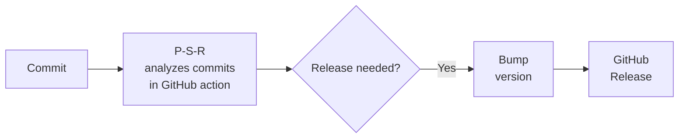
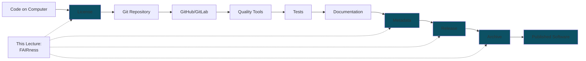

# FAIRness and Software Publication

Making research software findable, accessible, interoperable, and reusable

<div class="pt-12">
  <span @click="$slidev.nav.next" class="px-2 py-1 rounded cursor-pointer" hover:bg="white op-10">
    Press Space for next page <carbon:arrow-right class="inline"/>
  </span>
</div>

<div class="abs-tl m-6 flex">
  
</div>
<div class="abs-bl m-6 flex gap-4 items-center">
  
  
  
</div>

<div class="abs-br m-6 flex gap-2">
  <a href="https://everse.software/RSQKit/" target="_blank" alt="RSQKit" title="Open RSQKit"
    class="text-xl slidev-icon-btn opacity-50 !border-none !hover:text-white">
    <carbon:logo-github />
  </a>
</div>

<!--
Welcome to this lecture on FAIRness and software publication. We'll cover FAIR principles, metadata, licensing, and archiving.
-->

---
layout: two-cols
layoutClass: gap-16
---

# Lecture Overview

**Duration:** 90min <br>
**Target Audience:** Research software developers, PhD students, postdocs, researchers

::right::

## Topics

1. FAIR for Research Software (FAIR4RS) principles
2. The FAIR4RS principles in practice
3. Publishing Research Software

**Learning Outcomes:**
- Understand FAIR4RS principles
- Assess software quality and maturity
- License software
- Create metadata and citation files
- Version and release software
- Publish and archive software properly


---
layout: center
class: text-center
---

# FAIRness of Research Software


---
zoom: 0.8
---

# Quality Dimensions We've Covered This Week

<div class="grid grid-cols-2 gap-6 text-sm">
<div>

## Development Practices

- **Virtual Environments** → Flexibility, Maintainability
  - Isolated dependencies
  - Reproducible setups

- **Unit Testing** → Maintainability, Functional Suitability
  - Verify correctness
  - Enable refactoring

- **Debugging** → Maintainability
  - Find and fix issues
  - Understand code behavior

- **Documentation** → Maintainability
  - Explain purpose and usage
  - Onboard new contributors

</div>

<div>
<v-click>

## Advanced Topics

- **Profiling/Optimizing** → Performance Efficiency
  - Identify bottlenecks
  - Improve resource usage

- **Containerization** → Flexibility, Sustainability
  - Reproducible environments
  - Easy deployment

- **Security** → Security, Reliability
  - Protect against vulnerabilities
  - Secure data handling

- **Coding with AI** → Interaction Capability, Functional Suitability
  - Accelerate development
  - Generate boilerplate code

</v-click>
</div>
</div>

<div v-click class="mt-6 p-4 bg-blue-50 dark:bg-blue-900 rounded">
💡 An important one still missing: FAIRness
</div>


---
level: 2
---

# The Missing Dimension: FAIRness

<div class="grid grid-cols-2 gap-8">
<div>

## What is FAIR?

<v-click>

4 principles for data objects:

- **F**indable - Easy to discover by humans & machines
- **A**ccessible - Retrievable via standard protocols
- **I**nteroperable - Exchange data through standards
- **R**eusable - Usable and modifiable by others

</v-click>

<div v-click class="mt-4 p-4 bg-yellow-50 dark:bg-yellow-900 rounded">
FAIRness is about discoverability and reusability
</div>

</div>
<div>

<v-click>

## FAIR vs Quality

- FAIR ⊂ Quality Software
- FAIR ensures **discoverability** & **reusability**
- Quality includes **correctness**, **performance**, **testing**

</v-click>

</div>
</div>

<!-- ---

## FAIR in Practice

<v-clicks>

- 📄 **Proper documentation** (README, docs)
- ⚖️ **Clear licensing** (MIT, Apache, GPL)
- 📋 **Metadata files** (codemeta.json, CITATION.cff)
- 📦 **Package repositories** (PyPI, Conda)
- 🏛️ **Archiving** (Zenodo, Software Heritage)
- 🔗 **Persistent identifiers** (DOIs)

</v-clicks> -->

---
zoom: 0.85
---

# FAIR Principles for Research Software (FAIR4RS)

<div class="grid grid-cols-2 gap-4 text-[11px] mt-4">

<div class="p-3 border border-blue-200 rounded-lg bg-blue-50/30 dark:bg-blue-900/10">
<h3 class="text-blue-600 font-bold mb-1 flex items-center gap-2"><carbon:search /> F.indable</h3>
<p class="mb-2 italic opacity-70">Easy for humans and machines to find.</p>
<ul class="list-none p-0 space-y-1">
  <li v-click><b>F1.</b> Assigned unique & persistent ID (DOI)</li>
  <li v-click class="ml-3 opacity-80 border-l-2 pl-2"><b>F1.1.</b> IDs for different components</li>
  <li v-click class="ml-3 opacity-80 border-l-2 pl-2"><b>F1.2.</b> IDs for different versions</li>
  <li v-click><b>F2.</b> Described with rich metadata</li>
  <li v-click><b>F3.</b> Metadata explicitly points to ID</li>
  <li v-click><b>F4.</b> Metadata are searchable & indexable</li>
</ul>
</div>

<div class="p-3 border border-green-200 rounded-lg bg-green-50/30 dark:bg-green-900/10">
<h3 class="text-green-600 font-bold mb-1 flex items-center gap-2"><carbon:cloud-download /> A.ccessible</h3>
<p class="mb-2 italic opacity-70">Retrievable via standard protocols.</p>
<ul class="list-none p-0 space-y-1">
  <li v-click><b>A1.</b> Retrievable by ID using standard protocols</li>
  <li v-click class="ml-3 opacity-80 border-l-2 pl-2"><b>A1.1.</b> Open, free & universal protocol</li>
  <li v-click class="ml-3 opacity-80 border-l-2 pl-2"><b>A1.2.</b> Auth/Auth procedure where needed</li>
  <li v-click><b>A2.</b> Metadata persists even if software is gone</li>
</ul>
</div>

<div class="p-3 border border-purple-200 rounded-lg bg-purple-50/30 dark:bg-purple-900/10">
<h3 class="text-purple-600 font-bold mb-1 flex items-center gap-2"><carbon:connect /> I.nteroperable</h3>
<p class="mb-2 italic opacity-70">Exchange data and interact via APIs.</p>
<ul class="list-none p-0 space-y-1">
  <li v-click><b>I1.</b> Meets community standards for exchange</li>
  <li v-click><b>I2.</b> Includes qualified references to other objects</li>
</ul>
</div>

<div class="p-3 border border-orange-200 rounded-lg bg-orange-50/30 dark:bg-orange-900/10">
<h3 class="text-orange-600 font-bold mb-1 flex items-center gap-2"><carbon:recycle /> R.eusable</h3>
<p class="mb-2 italic opacity-70">Understandable, modifiable, and buildable.</p>
<ul class="list-none p-0 space-y-1">
  <li v-click><b>R1.</b> Rich and accurate attributes</li>
  <li v-click class="ml-3 opacity-80 border-l-2 pl-2"><b>R1.1.</b> Clear and accessible License</li>
  <li v-click class="ml-3 opacity-80 border-l-2 pl-2"><b>R1.2.</b> Detailed provenance & history</li>
  <li v-click><b>R2.</b> References to other software</li>
  <li v-click><b>R3.</b> Meets domain-relevant community standards</li>
</ul>
</div>

</div>

<div class="mt-4 text-[13px] opacity-50 italic">
Chue Hong, N. P. et al. (2022). FAIR Principles for Research Software (FAIR4RS Principles). <a href="https://doi.org/10.1038/s41597-022-01710-x
">DOI: 10.15497/RDA/00068</a>
</div>

---
zoom: 1.
---

# FAIR4RS in Practice

Translating abstract principles into concrete tools and files in your repository.

<div class="grid grid-cols-2 gap-4 text-[11px] mt-4">

<!-- F.INDABLE -->
<div class="p-3 border border-blue-200 rounded-lg bg-blue-50/30 dark:bg-blue-900/10">
<h3 class="text-blue-600 font-bold mb-1 flex items-center gap-2"><carbon:search /> F.indable</h3>
<ul class="list-none p-0 space-y-2">
  <li v-click>
    <b class="text-blue-700 dark:text-blue-300">Repository & Identifiers</b>
    <div class="opacity-80">Public Git repo + DOI (Zenodo/Figshare) or SWHID</div>
  </li>
  <li v-click>
    <b class="text-blue-700 dark:text-blue-300">Standard Metadata</b>
    <div class="opacity-80"><code>codemeta.json</code> and <code>CITATION.cff</code> files</div>
  </li>
  <li v-click>
    <b class="text-blue-700 dark:text-blue-300">Indexing</b>
    <div class="opacity-80">Register in PyPI, Conda-forge, or domain registries</div>
  </li>
</ul>
</div>

<!-- A.CCESSIBLE -->
<div class="p-3 border border-green-200 rounded-lg bg-green-50/30 dark:bg-green-900/10">
<h3 class="text-green-600 font-bold mb-1 flex items-center gap-2"><carbon:cloud-download /> A.ccessible</h3>
<ul class="list-none p-0 space-y-2">
  <li v-click>
    <b class="text-green-700 dark:text-green-300">Software Access</b>
    <div class="opacity-80">HTTPS/SSH for clones, <code>pip install</code> for users</div>
  </li>
  <li v-click>
    <b class="text-green-700 dark:text-green-300">Metadata Longevity</b>
    <div class="opacity-80">Archiving in Zenodo ensures metadata stays even if repo disappears</div>
  </li>
</ul>
</div>

<!-- I.NTEROPERABLE -->
<div class="p-3 border border-purple-200 rounded-lg bg-purple-50/30 dark:bg-purple-900/10">
<h3 class="text-purple-600 font-bold mb-1 flex items-center gap-2"><carbon:connect /> I.nteroperable</h3>
<ul class="list-none p-0 space-y-2">
  <li v-click>
    <b class="text-purple-700 dark:text-purple-300">Standard Formats</b>
    <div class="opacity-80">Use CSV, JSON, HDF5, or community-specific standards</div>
  </li>
  <li v-click>
    <b class="text-purple-700 dark:text-purple-300">Qualified References</b>
    <div class="opacity-80">Reference other tools/data using their DOIs</div>
  </li>
  <li v-click>
    <b class="text-purple-700 dark:text-purple-300">Controlled vocabularies</b>
    <div class="opacity-80">Standard terminology/Domain ontologies</div>
  </li>
</ul>
</div>

<!-- R.EUSABLE -->
<div class="p-3 border border-orange-200 rounded-lg bg-orange-50/30 dark:bg-orange-900/10">
<h3 class="text-orange-600 font-bold mb-1 flex items-center gap-2"><carbon:recycle /> R.eusable</h3>
<ul class="list-none p-0 space-y-2">
  <li v-click>
    <b class="text-orange-700 dark:text-orange-300">Documentation</b>
    <div class="opacity-80">Rich <code>README.md</code>, usage examples, and API docs</div>
  </li>
  <li v-click>
    <b class="text-orange-700 dark:text-orange-300">Legal Terms</b>
    <div class="opacity-80">Include a <code>LICENSE</code> file (MIT, Apache, GPL)</div>
  </li>
  <li v-click>
    <b class="text-orange-700 dark:text-orange-300">Community & Provenance</b>
    <div class="opacity-80"><code>CONTRIBUTING.md</code> and <code>CHANGELOG.md</code></div>
  </li>
</ul>
</div>

</div>


---
zoom: 0.9
---

# FAIRness Assessment Tools

## Available Tools

<v-clicks>

- **[FAIR Software Checklist](https://fairsoftwarechecklist.net/)** - Self-assessment
- **[howfairis](https://www.howfairis.com/)** - Command-line and online tool

</v-clicks>

<v-click>

## Purpose

- 🎯 **Diagnostic**, not evaluative
- 📊 Make quality aspects visible
- 🔍 Identify strengths & areas for improvement
- 📈 Guide reflection and learning

</v-click>

<div v-click class="mt-4 p-3 bg-yellow-50 dark:bg-yellow-900 rounded text-sm">
⚠️ Not meant to criticize - but to help improve!
</div>


<div class="abs-br m-6 text-sm opacity-50">
Source: RSQKit - FAIR Research Software
</div>

---
zoom: 0.9
---

## Exercise

Run `howfairis` on `pkoffee` and discuss results

```bash
pip install howfairis
howfairis https://github.com/<username>/pkoffee
```
```bash
docker run --rm fairsoftware/howfairis https://github.com/s3-school/pkoffee
```

or go to [https://www.howfairis.com/](https://www.howfairis.com/), connect your GitHub account and run on your `pkoffee` fork.

### Example Output
```
(1/5) repository
      ✓ has_open_repository
(2/5) license
      × has_license
(3/5) registry
      × in_package_registry
(4/5) citation
      × has_citation_file
(5/5) checklist
      × has_checklist
```

<div v-click class="mt-4 p-3 bg-yellow-50 dark:bg-yellow-900 rounded text-sm">
Let's try to improve that evaluation together → 
</div>


---
layout: center
class: text-center
---

# Software metadata and Essential Files


<!--
These tools help you understand where your software stands and guide improvements.
-->

---
level: 2
---

# Software Licensing

<div class="grid grid-cols-2 gap-8">

<div>

## Why License?

- Defines what others can do
- Required for legal reuse
- Part of FAIR principles (R1.1)

<div class="mt-6 p-4 bg-red-50 dark:bg-red-900 rounded">
❌ **No license = No one can legally use your code**

Even if it's on GitHub!
</div>

</div>

<div>

## License Categories

<v-clicks>

1. **Public Domain** - No restrictions
   - CC0, Unlicense

2. **Permissive** - Minimal restrictions
   - MIT, Apache 2.0, BSD

3. **Copyleft** - Share-alike required
   - GPL v3, AGPL, LGPL

4. **Creative Commons** - For non-code
   - CC-BY, CC-BY-SA (not for software!)

</v-clicks>

</div>

</div>

<div class="abs-br m-6 text-sm opacity-50">
Source: RSQKit - Licensing Software
</div>

<!--
Licensing is crucial. Without it, your code is technically copyrighted and can't be used.
-->

---
zoom: 0.9
---

# Popular Licenses for Research

<div class="grid grid-cols-3 gap-6">

<div>

### MIT License ⭐
**Most Popular**

✅ Commercial use<br>
✅ Modification<br>
✅ Distribution<br>
✅ Private use<br>
✅ No liability

⚠️ Derived work must include license

<div class="text-xs mt-3 opacity-70">
Short, simple, permissive
</div>

</div>

<div>

### Apache 2.0
**Patent protection**

✅ Same as MIT<br>
✅ Patent grant<br>
✅ Trademark protection

⚠️ Must state changes<br>
⚠️ Include NOTICE file

<div class="text-xs mt-3 opacity-70">
Better for large projects
</div>

</div>

<div>

### GPL v3
**Strong copyleft**

✅ Derivatives must be open<br>
✅ Anti-tivoization<br>
✅ Patent grant

⚠️ Can limit adoption<br>
⚠️ Incompatible with some licenses

<div class="text-xs mt-3 opacity-70">
Ensures freedom
</div>

</div>

</div>

<div class="mt-8 text-center text-2xl">
<a href="https://choosealicense.com" target="_blank">👉 choosealicense.com</a>
</div>

<div v-click class="mt-6 p-4 bg-blue-50 dark:bg-blue-900 rounded">
💡 For research software: MIT or Apache 2.0 are most common. Use GPL if you want to ensure derivatives stay open.
</div>

<div class="abs-br m-6 text-sm opacity-50">
Source: RSQKit - Licensing Software
</div>

<!--
MIT and Apache 2.0 maximize reuse. GPL ensures derivatives remain open but may limit adoption.
-->

---
zoom: 0.7
---

# Exercise: Add a License to Your Project

<div class="grid grid-cols-3 gap-6">

<div class="col-span-1">

## Steps

<v-clicks>

1. **Choose a license**
   - Use choosealicense.com
   - Consider your goals
   - Check funder requirements

2. **Add LICENSE file**
   - Create `LICENSE` or `LICENSE.txt`
   - Copy license text
   - Fill in year and copyright holder

3. **Add to metadata**
   - Update `pyproject.toml`
   - Add to `codemeta.json`
   - Include in `CITATION.cff`

4. **Add license headers** (optional)
   - Add to source files
   - Use SPDX identifiers

</v-clicks>

</div>

<div class="col-span-2">

<v-click>

## Example: MIT License

```text
Copyright 2026 Thomas Vuillaume

Permission is hereby granted, free of charge, to any person obtaining a copy of this software and associated documentation files (the “Software”), 
to deal in the Software without restriction, including without limitation the rights to use, copy, modify, merge, publish, distribute, sublicense, 
and/or sell copies of the Software, and to permit persons to whom the Software is furnished to do so, subject to the following conditions:

The above copyright notice and this permission notice shall be included in all copies or substantial portions of the Software.

THE SOFTWARE IS PROVIDED “AS IS”, WITHOUT WARRANTY OF ANY KIND, EXPRESS OR IMPLIED, INCLUDING BUT NOT LIMITED TO THE WARRANTIES OF MERCHANTABILITY, 
FITNESS FOR A PARTICULAR PURPOSE AND NONINFRINGEMENT. IN NO EVENT SHALL THE AUTHORS OR COPYRIGHT HOLDERS BE LIABLE FOR ANY CLAIM, DAMAGES OR OTHER 
LIABILITY, WHETHER IN AN ACTION OF CONTRACT, TORT OR OTHERWISE, ARISING FROM, OUT OF OR IN CONNECTION WITH THE SOFTWARE OR THE USE OR OTHER 
DEALINGS IN THE SOFTWARE.
```

</v-click>

<v-click>

## In pyproject.toml

```toml
[project]
name = "my-package"
license = {text = "MIT"}
# or
license = {file = "LICENSE"}
```

</v-click>


<v-click>

## SPDX Header (optional)

```python
# SPDX-License-Identifier: MIT
# Copyright (c) 2026 Thomas Vuillaume
```

</v-click>

</div>

</div>

<div class="abs-br m-6 text-sm opacity-50">
Source: RSQKit - Licensing Software
</div>

<!--
Adding a license is simple but essential. Don't skip this step!
-->


---
level: 2
---

# Software Metadata

<div class="grid grid-cols-2 gap-6">

<div>

## What is Metadata?

<v-click>

Structured data describing your software:

</v-click>

<v-click>

- 📝 Name, version, description
- 👥 Authors, contributors
- ⚖️ License
- 🔗 Repository URL
- 🐍 Programming language
- 📦 Dependencies
- 📄 Documentation links

</v-click>

<div v-click class="mt-4 p-3 bg-blue-50 dark:bg-blue-900 rounded text-sm">
💡 Machine-readable metadata enables discoverability & automation
</div>

</div>

<div>

<v-click>

## Why It Matters

</v-click>

<v-click>

- 🔍 **Findability** - Search engines can discover it
- 🤖 **Automation** - Tools can process it
- 🔄 **Interoperability** - Different platforms understand it
- 📚 **Archives** - Zenodo, Software Heritage can ingest it
- 📖 **Citation** - Automatic citation generation

</v-click>

<div v-click class="mt-4 p-3 bg-purple-50 dark:bg-purple-900 rounded text-sm">
Different use cases need different metadata:<br>
<ul>
<li>Citation: Authors, DOI</li>
<li>Replication: Dependencies, versions</li>
<li>Discovery: Keywords, description</li>
</ul> 
</div>

</div>
</div>

<div class="abs-br m-6 text-sm opacity-50">
Source: RSQKit - Software Metadata
</div>

<!--
Metadata is the key to making software FAIR. It bridges human and machine understanding.
-->

---
zoom: 0.85
---

# Metadata Standards

<div class="grid grid-cols-2 gap-6 text-sm">

<div>

## Common Standards

<v-clicks>

<div>

### pyproject.toml
- Package manager metadata
- Language-specific

</div>

<div>

### CodeMeta
- JSON-LD format
- Based on Schema.org
- `codemeta.json`
- Widely supported (Zenodo, Software Heritage)

</div>
<div>

### Citation File Format (CFF)
- YAML format
- Academic citation
- `CITATION.cff`
- GitHub native support (Shows a button "Cite this repository" automatically)
- Zenodo support
- Specifies prefeffed citation

</div>
</v-clicks>

</div>

<div v-after>

## Comparison

| Feature | CodeMeta | CFF |
|---------|----------|-----|
| Format | JSON-LD | YAML |
| Purpose | General | Citation |
| GitHub Support | Via API | Native |
| Human Readable | Medium | High |
| Machine Readable | ✔︎ | ✔︎ |

<v-click>

## Best Practice

**Use both!**
- `codemeta.json` for comprehensive metadata
- `CITATION.cff` for citation
- Plus language-specific files

</v-click>

</div>

</div>

<div class="abs-br m-6 text-sm opacity-50">
Source: RSQKit - Software Metadata
</div>

<!--
Different standards serve different purposes. Using multiple standards increases discoverability.
-->

---
zoom: 1
---

# CodeMeta example

<div class="grid grid-cols-12 gap-6">

<div class="col-span-8">

`codemeta.json`

```json
{
  "@context": "https://doi.org/10.5063/schema/codemeta-2.0",
  "@type": "SoftwareSourceCode",
  "name": "My Research Software",
  "description": "A tool for scientific data analysis",
  "version": "1.0.0",
  "author": [{
    "@type": "Person",
    "givenName": "Jane",
    "familyName": "Doe",
    "email": "jane@example.org",
    "affiliation": {
      "@type": "Organization",
      "name": "University of Example"
    }
  }],
  "license": "https://spdx.org/licenses/MIT",
  "programmingLanguage": "Python",
  "codeRepository": "https://github.com/user/repo"
}
```

</div>

<div class="col-span-4">

### Tools:
- [CodeMeta Generator](https://codemeta.github.io/codemeta-generator/) - Web form
- [SOMEF](https://github.com/KnowledgeCaptureAndDiscovery/somef) - Automatic extraction
- [autocodemeta](https://w3id.org/autocodemeta) - Automatic extraction as web service
- [CodeMeta Lookup](https://codemeta.github.io/codemeta-lookup/) - Crosswalks

</div>

</div>


<div class="abs-br m-6 text-sm opacity-50">
Source: https://codemeta.github.io/
</div>

<!--
CodeMeta is machine-readable and widely supported. Create it once, reuse everywhere.
-->

---
zoom: 0.9
---

# Citation File Format (CFF) example

<div class="grid grid-cols-12 gap-6">

<div class="col-span-8">

`citation.cff`

```yaml
cff-version: 1.2.0
message: "If you use this software, please cite it as below."
title: "My Research Software"
version: 1.0.0
date-released: 2024-01-15
authors:
  - family-names: "Doe"
    given-names: "Jane"
    orcid: "https://orcid.org/0000-0000-0000-0000"
    affiliation: "University of Example"
repository-code: "https://github.com/user/repo"
license: MIT
keywords:
  - research software
  - data analysis
preferred-citation:
  type: article
  title: "Software Paper Title"
  authors:
    - family-names: "Doe"
      given-names: "Jane"
  doi: "10.1234/example.doi"
  journal: "Journal of Open Source Software"
  year: 2024
```

</div>

<div class="col-span-4">

### Tools:
- [cffinit](https://citation-file-format.github.io/cff-initializer-javascript/) - Web form
- [CFF Validator](https://citation-file-format.github.io/) - Check syntax

</div>

</div>

<div class="abs-br m-6 text-sm opacity-50">
Source: RSQKit - Software Metadata
</div>

<!--
CFF is specifically for academic citation. It integrates beautifully with GitHub and Zenodo.
-->


---
zoom: 0.8
---

# Exercise: Create Metadata Files

<div class="mt-4 opacity-70">
⏱️ 15 minutes hands-on
</div>

<div class="grid grid-cols-2 gap-4 text-sm">
<div>

## Your Task

Create both metadata files for your `pkoffee` project:

### 1. codemeta.json
- Use [autocodemeta](https://w3id.org/autocodemeta)
- Fill in your repository URL
- Add missing information
- Download `codemeta.json`

### 2. CITATION.cff
- Use [CFF Initializer](https://citation-file-format.github.io/cff-initializer-javascript/)
- Add your author information
- Include repository URL
- Download and validate

### 3. Add to Repository
- Place files in repository root
- Commit and push
- Verify GitHub recognizes them -> Cite button appears

</div>

<div>

## Bonus

- Try `howfairis` again - did your score improve?

<div class="mt-6 p-3 bg-yellow-50 dark:bg-yellow-900 rounded">
💡 Use <a href="https://figshare.com/articles/preprint/Coffee_and_Developer_Productivity/31049104?file=60960952">journal preprint</a>
as related paper
</div>

<div class="mt-6 p-3 bg-blue-50 dark:bg-blue-900 rounded">
💡 These files will be used when archiving to Zenodo!
</div>

</div>

</div>

---
zoom: 0.8
---

# Summary: Essential Files for Publication

<div class="grid grid-cols-2 gap-4 text-sm">

<div>

### 📄 README.md

<v-clicks>

- Project description
- Installation instructions
- Usage examples
- Dependencies
- Citation information
- Contact details

</v-clicks>

<div v-click>

```markdown
# My Research Software

## Description
Brief description of what it does

## Installation
\```bash
pip install my-software
\```

## Usage
\```python
import my_software
result = my_software.analyze(data)
\```

## Citation
If you use this software, please cite:
[DOI or paper reference]
```

</div>

</div>

<div>

### ⚖️ LICENSE

<v-click>

**Without a license, code cannot be legally reused!**

</v-click>

<v-clicks>

### 📋 Metadata & Citation
- `codemeta.json` (General metadata)
- `CITATION.cff` (Academic citation)

### 🤝 CONTRIBUTING.md
- How to contribute
- Code of conduct
- Development setup

### 📝 CHANGELOG.md
- Version history
- What changed between releases

### 📚 docs/
- Detailed documentation
- API reference
- Tutorials

</v-clicks>

</div>

</div>

<div class="abs-br m-6 text-sm opacity-50">
Source: RSQKit - Publishing Software
</div>

<!--
These files make your software professional and usable by others. README is your first impression!
-->


---
layout: center
class: text-center
---

# Publishing Research Software


---
level: 2
---

# Software Publication ≠ Code Hosting

<div class="grid grid-cols-2 gap-8">

<div>

## Code Hosting (GitHub/GitLab)

<v-click>

- ✅ Version control
- ✅ Collaboration
- ✅ Issue tracking
- ✅ Code review

</v-click>

<div v-click class="mt-4 p-3 bg-yellow-50 dark:bg-yellow-900 rounded text-sm">
⚠️ This is a great start, but not enough!
</div>

</div>
<div>
<v-click>

## Full Publication Includes

- 📄 **Documentation** - README, guides
- ⚖️ **License** - Legal reuse terms
- 📋 **Metadata** - Findability
- 🏷️ **Citation** - Academic credit
- <v-mark color="yellow">📦 Packaging - Easy installation</v-mark>
- <v-mark color="yellow">🔖 Releases - Version management</v-mark>
- <v-mark color="yellow">🏛️ Archiving - Long-term preservation</v-mark>

</v-click>

</div>

</div>

<div v-click class="mt-6 p-4 bg-blue-50 dark:bg-blue-900 rounded">
💡 Publishing is the finale touch to make your software FAIR
</div>

<div class="abs-br m-6 text-sm opacity-50">
Source: RSQKit - Publishing Software
</div>

<!--
Putting code on GitHub is step one. Full publication requires several additional components.
-->


---
level: 2
---

# Software Releases and Versioning

<div class="grid grid-cols-2 gap-6">

<div>

## What is a Release?

<v-click>

A snapshot of your software at a specific point in time, made available to users.

**Components:**
- 🏷️ **Version number/name**
- 📝 **Changelog**
- 📄 **Release notes**
- 📦 **Artifacts** (binaries, packages)

</v-click>

<div v-click class="mt-4 p-3 bg-blue-50 dark:bg-blue-900 rounded text-sm">
💡 Releases provide stable reference points for users and citations
</div>

</div>

<div>

<v-click>

## Versioning Schemes

### Semantic Versioning (SemVer)
```
MAJOR.MINOR.PATCH
  1  .  2  .  3

MAJOR: Breaking changes
MINOR: New features (backward compatible)
PATCH: Bug fixes
```

### Examples
- `1.0.0` → First stable release
- `1.1.0` → Added new feature
- `1.1.1` → Fixed bug
- `2.0.0` → Breaking change

</v-click>

</div>

</div>

<div class="abs-br m-6 text-sm opacity-50">
Source: RSQKit - Releasing Software
</div>

<!--
Proper versioning helps users understand what changed and whether they need to update.
-->

---

# Automated Versioning (advanced users)

<div class="grid grid-cols-2 gap-8 text-[12px]">

<div>

### 🏷️ [setuptools_scm](https://setuptools-scm.readthedocs.io/en/latest/)
Infer version automatically from Git tags.

<details>
<summary>See pyproject.toml content</summary>
```toml
[build-system]
requires = ["setuptools>=64", "setuptools-scm>=8"]
build-backend = "setuptools.build_meta"

[tool.setuptools_scm]
write_to = "src/pkoffee/_version.py"
```
</details>

<details>
<summary>See pixi.toml content</summary>
```toml
[build-dependencies]
setuptools-scm = ">=8"
```
</details>

Version format:

- On tag v0.1.0 → version is 0.1.0
- Between tags → 0.1.0.dev3+g1234567 (dev version with commit info)

No manual version bumping needed - just create git tags when you want to release. The version is computed at build time from your git history.
</div>
<div>

### 🤖 [Python Semantic Release](https://python-semantic-release.readthedocs.io/en/stable/)
Automates versioning, changelog, and tagging based on commit history.

**Requirement**: Uses [Conventional Commits](https://www.conventionalcommits.org/)
- `feat: ...` → **Minor**
- `fix: ...` → **Patch**
- `BREAKING CHANGE: ...` → **Major**

**In GitHub Actions**:
```yaml
- name: Release
  uses: python-semantic-release/python-semantic-release@v9
  with:
    github_token: ${{ secrets.GITHUB_TOKEN }}
```



</div>

</div>

<!--
Automated versioning removes the risk of forgetting to update version strings across multiple files.
-->

---
zoom: 0.9
---

# Creating a GitHub Release

<div class="grid grid-cols-2 gap-6 text-sm">

<div>

## Steps

<v-clicks>

1. **Prepare**
   - Update version in code: `pyproject.toml`, `codemeta.json`, `citation.cff`
   - Ensure tests pass

1. **Create release on GitHub**
   - Go to Releases → "Draft a new release"
   - Create a new tag
   - Write release notes
      - Note: you can generate them based on past PRs
      - It's good to add a summary at the beginning
   - Attach binaries if needed

1. **Publish**
   - Review everything
   - Click "Publish release"
   - Zenodo integration triggers (if enabled, see after)

</v-clicks>

</div>

<div>
<v-click>

## Release Notes Template

```markdown
## What's New in v1.0.0

### Features
- Added support for new data format (#42)
- Improved performance by 50% (#38)

### Bug Fixes
- Fixed crash on empty input (#45)
- Corrected calculation error in module X (#41)

### Breaking Changes
- Removed deprecated function old_api()
- Changed default behavior of process()

### Dependencies
- Updated numpy to 1.24+
- Added new requirement: pandas >= 1.5

## Contributors
Thanks to @user1, @user2 for contributions!
```
</v-click>
</div>

</div>

---
zoom: 0.9
---

# Python Packaging and Distribution (PyPI)

<div class="grid grid-cols-2 gap-8 text-sm">

<div>

## 🛠️ Building Your Package

Ensures your code is packaged correctly for distribution.

<v-clicks>

1. **Ensure `pyproject.toml` is complete**
   - Metadata, dependencies, build-system

2. **Install build tools**
   ```bash
   pip install build twine
   ```

3. **Build the package**
   ```bash
   python -m build
   ```
   This creates `dist/` with `.whl` and `.tar.gz` files.

</v-clicks>

</div>

<div>

## 🚀 Publishing to PyPI

Makes your software installable via `pip install`.

<v-clicks>

0. **Setup Account**
   - Create account on [PyPI](https://pypi.org/) and [TestPyPI](https://test.pypi.org/)
   - Generate an **API Token** in Account Settings

1. **Upload to TestPyPI first** (Recommended)
   ```bash
   python -m twine upload --repository testpypi dist/*
   ```

2. **Upload to PyPI**
   ```bash
   python -m twine upload dist/*
   ```

</v-clicks>

<div v-click class="mt-4 p-3 bg-yellow-50 dark:bg-yellow-900 rounded">
❌ for pkoffee you won't be able to publish because it already exists on pypi
</div>

</div>

</div>

<div v-click class="mt-4 p-3 bg-blue-50 dark:bg-blue-900 rounded">
💡 Automate with GitHub Actions to publish a new package version at each release
</div>

<!--
Packaging your software makes it easy for others to install. PyPI is the standard repository for Python.
-->


<!--
Clear release notes help users understand what changed and how to upgrade.
-->

---
level: 2
---

# Why Archive Software?

<div class="grid grid-cols-2 gap-6">

<div>

## The Problem

<v-clicks>

**GitHub/GitLab are NOT archives:**
- Commercial platforms
- Can change policies
- Repositories can be deleted
- URLs can break
- No guarantee of permanence

</v-clicks>

<div v-click class="mt-4 p-4 bg-red-50 dark:bg-red-900 rounded text-sm">
⚠️ What happens to your research software in 10 years?
</div>

</div>

<div>
<v-click>

## A Solution: Archiving
</v-click>
<v-clicks>

**True archives provide:**
- 🏛️ **Long-term preservation** (decades)
- 🔒 **Persistent identifiers** (DOIs)
- 📋 **Metadata preservation**
- 🔍 **Discoverability** in academic systems
- ✅ **Trustworthy** repositories
- 🌐 **Integration** with citation systems

</v-clicks>

</div>

</div>

<div class="abs-br m-6 text-sm opacity-50">
Source: RSQKit - Archiving Software
</div>

<!--
Archiving ensures your software remains accessible for the long term, essential for reproducibility.
-->


---
level: 2
---

# Software Archives

<div class="grid grid-cols-2 gap-6 text-sm">

<div>

## Zenodo

<v-clicks>

- **General-purpose** archive
- CERN-hosted (Europe)
- **Free** and open
- **DOI** for each version
- **GitHub integration**
- Supports all file types
- Part of OpenAIRE

### Good For:
- Software
- Datasets
- Supplementary materials

</v-clicks>

</div>

<div>

## Software Heritage

<v-clicks>

- **Universal** software archive
- UNESCO-supported
- Preserves all public source code
- **Software Heritage identifier** (SWHID)
- Automatic archiving
- link from HAL
- Complete Git history preserved -> better granularity of identifiers

### Good For:
- Software
- Being able to cite a specific part or commit of a software

</v-clicks>

</div>

</div>

<div v-click class="mt-6 p-4 bg-blue-50 dark:bg-blue-900 rounded">
💡 Recommendation: Use at least one 
</div>

<!--
Zenodo and Software Heritage serve complementary purposes. Both are free and trustworthy.
-->

---
zoom: 0.65
---

# Zenodo + GitHub Integration

<div class="grid grid-cols-2 gap-6">

<div>

## Setup Steps

<v-clicks>

1. **Create Zenodo account**
   - Visit [zenodo.org](https://zenodo.org/) (or [sandbox.zenodo.org](https://sandbox.zenodo.org/) for the exercise)
   - Log in with GitHub

2. **Enable repository**
   - Go to GitHub settings in Zenodo
   - Toggle on your repository

3. **Create a release**
   - Tag and release on GitHub
   - Zenodo automatically archives
   - DOI is minted

4. **Update metadata if necessary**
   - Edit metadata on Zenodo
   - Add keywords, description
   - Save changes

5. **Add DOI badge**
   - Copy badge markdown
   - Add to README

</v-clicks>

</div>

<div>
<v-click>

## What Gets Archived

- Complete repository snapshot
- Release artifacts
- Metadata from GitHub or `codemeta.json` or `CITATION.cff` (if present)

</v-click>
<v-click>

## DOI Badge

```markdown
[](https://doi.org/10.5281/zenodo.17814297)
```

Displays as:
[](https://doi.org/10.5281/zenodo.17814297)

</v-click>

<div v-click class="mt-4 p-3 bg-purple-50 dark:bg-purple-900 rounded text-sm">
💡 Each release gets a separate DOI. Zenodo also creates a "concept DOI" for all versions.
</div>

<div v-click class="mt-4 p-3 bg-yellow-50 dark:bg-yellow-900 rounded text-sm">
Exercise: do it using zenodo sandbox (exact replicate of zenodo but gets empited regularly)
</div>

</div>

</div>

<!--
The GitHub-Zenodo integration makes archiving automatic and easy.
-->

---

# Software Heritage Demo

## Save your code 

https://archive.softwareheritage.org/save/

## An example of saved code: gammapy

https://archive.softwareheritage.org/browse/origin/directory/?origin_url=https://github.com/gammapy/gammapy


---
level: 2
---

# Publication Checklist

<div class="grid grid-cols-2 gap-6 text-sm">

<div>

## Before First Release

<v-click>

- [ ] **LICENSE file** added
- [ ] **README.md** complete
  - Description
  - Installation
  - Usage examples
  - Citation
- [ ] **codemeta.json** created
- [ ] **CITATION.cff** created
- [ ] **Tests** written and passing
- [ ] **Documentation** available
- [ ] **Code formatted** and linted
- [ ] **Security scan** passed
- [ ] **CHANGELOG.md** started

</v-click>

</div>

<div>

## For Each Release

<v-click>

- [ ] **Version bumped** (following SemVer)
- [ ] **CHANGELOG updated**
- [ ] **Tests passing**
- [ ] **Documentation updated**
- [ ] **Git tag created**
- [ ] **GitHub release** created
- [ ] **Release notes** written
- [ ] **Archived** (Zenodo/Software Heritage)
- [ ] **DOI obtained**
- [ ] **README updated** with DOI
- [ ] **Announced** to users

</v-click>

</div>

</div>

<div v-click class="mt-6 p-4 bg-green-50 dark:bg-green-900 rounded text-center">
💡 Add this checklist to your GitHub repository wiki to keep it closeby when doing a release
</div>

<!--
Use this checklist to ensure you don't miss any steps in the publication process.
-->

---
level: 2
layout: two-cols
---

# Exercise

- Try `howfairis` one more time
- Compare before/after scores
- What improved?

<div class="mt-6 opacity-70">
⏱️ 20 minutes hands-on
</div>


<!--
This exercise brings together everything: metadata, releases, and archiving.
-->

---
layout: center
class: text-center
---

# Summary and Resources


---
level: 2
---

# Key Takeaways

<div class="grid grid-cols-2 gap-8">

<div>

## FAIR Principles

<v-click>

- **F**indable through metadata and identifiers
- **A**ccessible via standard protocols
- **I**nteroperable with standard formats
- **R**eusable with clear licenses
</v-click>

</div>
<div>

## Essential Components

<v-click>

- License (MIT, Apache 2.0)
- Metadata (codemeta.json, CITATION.cff)
- Documentation (README, docs)
- Releases (semantic versioning)
- Archiving (Zenodo, Software Heritage)

</v-click>

</div>
</div>


<!--
FAIR + Quality tools = High-quality, reusable research software
-->

---


# From Code to Published Software

<div class="text-center mb-6">



</div>

You now have a complete framework for creating high-quality, FAIR research software! 🎉

<!--
These two lectures together provide a complete path from code to published research software.
-->

---
zoom: 0.8
layout: end
---

# Resources and Further Learning

<div class="grid grid-cols-2 gap-6 text-sm">

<div>

## EVERSE RSQKit

<div style="text-align: left;">

- [RSQKit Home](https://everse.software/RSQKit/)
- [FAIR Research Software](https://everse.software/RSQKit/pages/research_software/fair_research_software.html)
- [Publishing Software](https://everse.software/RSQKit/pages/tasks/publishing_software.html)
- [Software Metadata](https://everse.software/RSQKit/pages/tasks/software_metadata.html)
- [Licensing](https://everse.software/RSQKit/pages/tasks/licensing_software.html)
- [Archiving](https://everse.software/RSQKit/pages/tasks/archiving_software.html)

</div>

## Tools

<div style="text-align: left;">

- [Choose a License](https://choosealicense.com/)
- [CodeMeta Generator](https://codemeta.github.io/codemeta-generator/)
- [CFF Initializer](https://citation-file-format.github.io/cff-initializer-javascript/)
- [howfairis](https://github.com/fair-software/howfairis)
- [Zenodo](https://zenodo.org/)

</div>

</div>

<div>

## Guides & Documentation

<div style="text-align: left;">

- [FAIR4RS Principles](https://doi.org/10.15497/RDA00068)
- [Software Citation Principles](https://www.force11.org/software-citation-principles)
- [Zenodo Help](https://help.zenodo.org/)
- [Software Heritage](https://www.softwareheritage.org/)
- [Semantic Versioning](https://semver.org/)

</div>

## Community

<div style="text-align: left;">

- [Research Software Engineers (RSE)](https://society-rse.org/)
- [EVERSE Project](https://everse.software/)
- [Software Sustainability Institute](https://www.software.ac.uk/)
- [US-RSE](https://us-rse.org/)

</div>

</div>

</div>

<div class="mt-8 text-center">

### Questions?

thomas.vuillaume@lapp.in2p3.fr

</div>

<div class="abs-br m-6 text-sm opacity-50">
Thank you!
</div>

<!--
These resources will help you continue on your journey to FAIR research software.
-->
