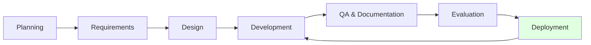
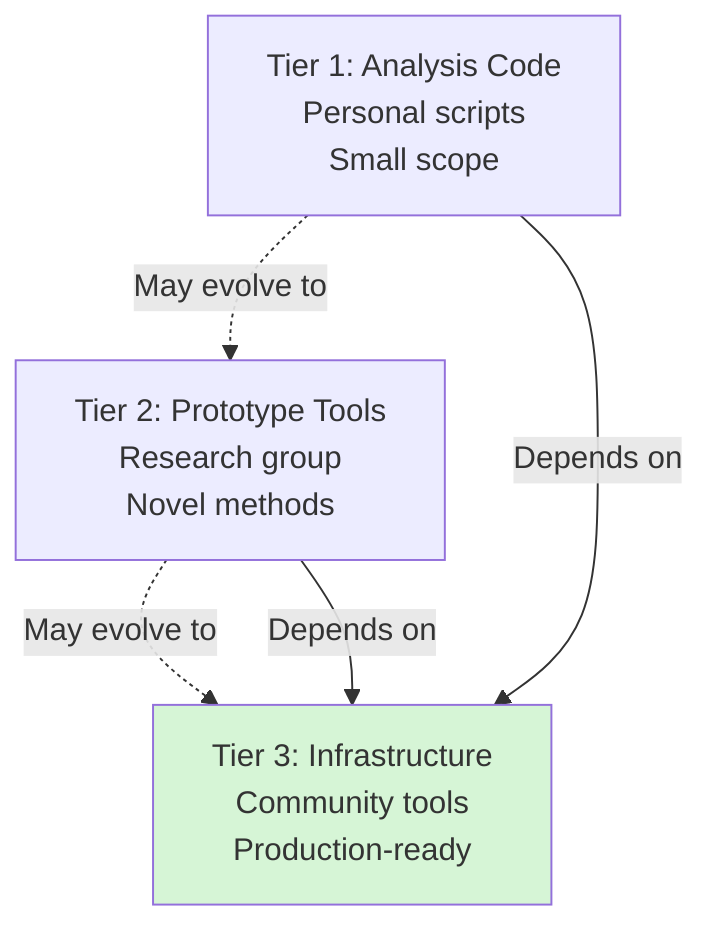
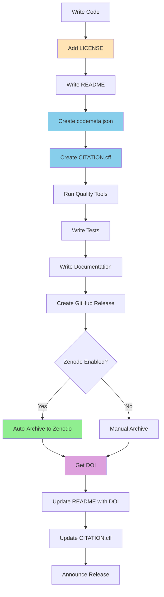
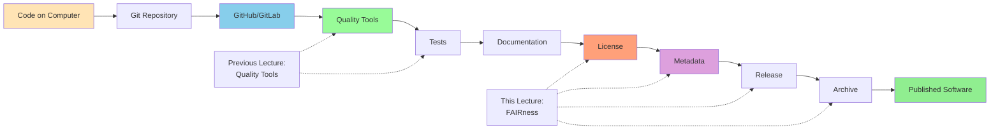

# FAIRness and Software Publication

Making research software findable, accessible, interoperable, and reusable

<div class="pt-12">
  <span @click="$slidev.nav.next" class="px-2 py-1 rounded cursor-pointer" hover:bg="white op-10">
    Press Space for next page <carbon:arrow-right class="inline"/>
  </span>
</div>

<div class="abs-br m-6 flex gap-2">
  <a href="https://everse.software/RSQKit/" target="_blank" alt="RSQKit" title="Open RSQKit"
    class="text-xl slidev-icon-btn opacity-50 !border-none !hover:text-white">
    <carbon:logo-github />
  </a>
</div>

<!--
Welcome to this lecture on FAIRness and software publication. We'll cover FAIR principles, metadata, licensing, and archiving.
-->
---
layout: center
class: text-center
---

# Module 1
## Software Quality Dimensions

<div class="text-xl mt-8 opacity-80">
20 minutes
</div>

---
level: 2
---

# Quality Dimensions We've Covered This Week

<div class="grid grid-cols-2 gap-6 text-sm">

<div>

## Development Practices

<v-clicks>

- **Virtual Environments** → Flexibility, Maintainability
  - Isolated dependencies
  - Reproducible setups

- **Unit Testing** → Maintainability, Functional Suitability
  - Verify correctness
  - Enable refactoring

- **Debugging** → Maintainability
  - Find and fix issues
  - Understand code behavior

- **Documentation** → Maintainability
  - Explain purpose and usage
  - Onboard new contributors

</v-clicks>

</div>

<div>

## Advanced Topics

<v-clicks>

- **Profiling/Optimizing** → Performance Efficiency
  - Identify bottlenecks
  - Improve resource usage

- **Containerization** → Flexibility, Sustainability
  - Reproducible environments
  - Easy deployment

- **Security** → Security, Reliability
  - Protect against vulnerabilities
  - Secure data handling

- **Coding with AI** → Interaction Capability, Functional Suitability
  - Accelerate development
  - Generate boilerplate code

</v-clicks>

</div>

</div>

<div v-click class="mt-6 p-4 bg-blue-50 dark:bg-blue-900 rounded">
💡 An important one still missing: FAIRness
→ it'll be covered in the next lecture on software publication
</div>

<div v-click class="mt-6 p-4 bg-blue-50 dark:bg-blue-900 rounded">
💡 But first I want to see some other tools that can help you improve these dimensions
</div>

<!--
This week we've covered many aspects of software quality. Today we'll see tools that help automate quality checks.
-->

---
level: 2
---


# The Missing Dimension: FAIRness

<div class="grid grid-cols-2 gap-8">

<div>

## What is FAIR?

<v-clicks>

- **F**indable - Easy to discover by humans & machines
- **A**ccessible - Retrievable via standard protocols
- **I**nteroperable - Exchange data through standards
- **R**eusable - Usable and modifiable by others

</v-clicks>

<div v-click class="mt-4 p-4 bg-yellow-50 dark:bg-yellow-900 rounded">
⚠️ **Important:** FAIRness is about **discoverability and reusability**, not just code quality
</div>

</div>

<div v-after>

## FAIR in Practice

<v-clicks>

- 📄 **Proper documentation** (README, docs)
- ⚖️ **Clear licensing** (MIT, Apache, GPL)
- 📋 **Metadata files** (codemeta.json, CITATION.cff)
- 📦 **Package repositories** (PyPI, Conda)
- 🏛️ **Archiving** (Zenodo, Software Heritage)
- 🔗 **Persistent identifiers** (DOIs)

</v-clicks>

<div v-click class="mt-4 p-3 bg-blue-50 dark:bg-blue-900 rounded text-sm">
💡 
</div>

</div>

</div>

<!--
Today we focus on code quality tools. FAIRness requires additional steps for publication and archiving.
-->

---
layout: two-cols
layoutClass: gap-16
---

# Lecture Overview

**Duration:** 2 hours  
**Target Audience:** Research software developers, PhD students, postdocs, researchers

::right::

## Topics

1. Understanding Research Software Quality
2. Software Lifecycle and Three-Tier Model
3. Publishing Research Software
4. Releasing and Archiving Software

**Learning Outcomes:**
- Understand FAIR principles for research software
- Assess software quality and maturity
- Create metadata and citation files
- Publish and archive software properly

<!--
This lecture connects research software engineering with scholarly publishing practices.
-->

---
layout: center
class: text-center
---

# Module 1
## Understanding Research Software Quality

<div class="text-xl mt-8 opacity-80">
30 minutes
</div>

---
level: 2
---

# What is Research Software Quality?

<div class="grid grid-cols-2 gap-8">

<div>

## Definition

Software that supports **reliable**, **efficient**, **maintainable**, and **trustworthy** research

<v-clicks>

### Key Questions to Ask

- 🔄 Will I get the same result tomorrow?
- 👥 Can someone else reproduce my analysis?
- ✅ How do I know my code does what I think?
- 🔍 Would another researcher understand my software?

</v-clicks>

</div>

<div v-click>

## Quality Aspects

- **Consistent behavior** - Same inputs → same outputs
- **Version control** - Track changes and versions
- **Automated testing** - Verify correctness
- **Environment management** - Reproducible setups
- **Clear code** - Readable and well-documented
- **Efficiency** - Optimal resource usage
- **Maintainability** - Easy to update and extend

</div>

</div>

<div class="abs-br m-6 text-sm opacity-50">
Source: RSQKit - Quality of Research Software
</div>

<!--
Quality in research software means ensuring your work is reproducible, reliable, and trustworthy.
-->

---
level: 2
---

# FAIR Principles for Research Software

<div class="grid grid-cols-2 gap-6">

<div>

## What is FAIR?

<v-clicks>

- **F**indable - Easy to discover by humans & machines
- **A**ccessible - Retrievable via standard protocols
- **I**nteroperable - Exchange data through standards
- **R**eusable - Usable and modifiable by others

</v-clicks>

</div>

<div v-after>

## FAIR vs Quality

<v-clicks>

- FAIR ⊂ Quality Software
- FAIR ensures **discoverability** & **reusability**
- Quality includes **correctness**, **performance**, **testing**
- High-quality software = FAIR + Engineering practices

</v-clicks>

<div v-click class="mt-4 p-4 bg-blue-50 dark:bg-blue-900 rounded">
💡 FAIR doesn't guarantee functionality - you still need testing!
</div>

</div>

</div>

<!--
FAIR is a crucial subset of quality, but not the whole picture. You need both FAIR principles and engineering practices.
-->

---
level: 2
---

# FAIR in Practice

<div class="grid grid-cols-2 gap-6 text-sm">

<div>

## Findable (F)

<v-clicks>

### F1. Software has a unique identifier
- DOI from Zenodo, Figshare
- Software Heritage persistent identifier

### F2. Software described with rich metadata
- `codemeta.json`, `CITATION.cff`
- README with clear description

### F3. Metadata includes identifier
- DOI in metadata files
- Cross-referencing

### F4. Software registered in searchable resource
- Listed in package repositories (PyPI, Conda)
- Registered in domain-specific catalogs

</v-clicks>

</div>

<div>

## Accessible (A)

<v-clicks>

### A1. Retrievable via standard protocols
- HTTPS for downloads
- Package managers (pip, conda)

### A2. Metadata accessible even if software isn't
- Metadata persists independently
- Tombstone records

</v-clicks>

<v-click>

## Interoperable (I)

### I1. Uses standard formats
- Standard data formats (CSV, JSON, HDF5)
- Standard APIs

### I2. Uses controlled vocabularies
- Standard terminology
- Domain ontologies

</v-click>

</div>

</div>

<div class="abs-br m-6 text-sm opacity-50">
Source: RSQKit - FAIR Research Software
</div>

<!--
These are concrete practices that make software FAIR. Each principle has specific requirements.
-->

---
level: 2
---

# FAIR Reusability (R)

<div class="grid grid-cols-2 gap-6">

<div>

## Reusable Principles

<v-clicks>

### R1. Accurate description
- Clear README
- Usage examples
- API documentation

### R1.1. Clear license
- OSI-approved license
- LICENSE file in repository
- License in metadata

### R1.2. Provenance information
- Authors, contributors
- Version history (CHANGELOG)
- Citation information

</v-clicks>

</div>

<div v-after>

## Making Software Reusable

<v-clicks>

### R2. Domain standards
- Follow community conventions
- Use standard libraries
- Implement common interfaces

### R3. Community standards
- Code of conduct
- Contributing guidelines
- Development documentation

</v-clicks>

<div v-click class="mt-4 p-3 bg-green-50 dark:bg-green-900 rounded text-sm">
💡 Reusability is about reducing barriers for others to use your software
</div>

</div>

</div>

<div class="abs-br m-6 text-sm opacity-50">
Source: RSQKit - FAIR Research Software
</div>

<!--
Reusability requires the most work but provides the most value. Clear licensing is critical.
-->

---
level: 2
---

# FAIRness Assessment Tools

<div class="grid grid-cols-2 gap-6">

<div>

## Available Tools

<v-clicks>

- **FAIRsoft evaluator** - Comprehensive assessment
- **FAIR software test** - Automated testing
- **FAIR Software Checklist** (ARDC) - Self-assessment
- **howfairis** - Command-line tool

</v-clicks>

<div v-click class="mt-4">

```bash
# Example: howfairis
pip install howfairis
howfairis https://github.com/user/repo
```

### Example Output
```
(1/5) repository
      ✓ has_open_repository
(2/5) license
      ✓ has_license
(3/5) registry
      × in_package_registry
(4/5) citation
      ✓ has_citation_file
(5/5) checklist
      × has_checklist
```

</div>

</div>

<div v-after>

## Purpose

<v-clicks>

- 🎯 **Diagnostic**, not evaluative
- 📊 Make quality aspects visible
- 🔍 Identify strengths & areas for improvement
- 📈 Guide reflection and learning

</v-clicks>

<div v-click class="mt-4 p-3 bg-yellow-50 dark:bg-yellow-900 rounded text-sm">
⚠️ Not meant to criticize - but to help improve!
</div>

<v-click>

## Exercise Idea

Run `howfairis` on your own repository and discuss results

</v-click>

</div>

</div>

<div class="abs-br m-6 text-sm opacity-50">
Source: RSQKit - FAIR Research Software
</div>

<!--
These tools help you understand where your software stands and guide improvements.
-->

---
layout: center
class: text-center
---

# Module 2
## Software Lifecycle and Three-Tier Model

<div class="text-xl mt-8 opacity-80">
25 minutes
</div>

---
level: 2
---

# Research Software Lifecycle

<div class="text-center mb-8">



</div>

<div class="grid grid-cols-2 gap-6 text-sm">

<div v-click>

**1. Planning** → Research questions, funding

**2. Requirements** → User stories, use cases

**3. Design** → Architecture, UI, data models

**4. Development** → Implementation, code review

</div>

<div v-click>

**5. QA & Documentation** → Testing, quality checks

**6. Evaluation** → User testing, reproducibility

**7. Deployment** → Packaging, containerization, **publication**

</div>

</div>

<div v-click class="mt-6 p-4 bg-green-50 dark:bg-green-900 rounded">
💡 **Software Management Plans (SMPs)** help organize this lifecycle
</div>

<div class="abs-br m-6 text-sm opacity-50">
Source: RSQKit - Research Software Lifecycle
</div>

<!--
The lifecycle shows the journey from initial idea to deployed software. Publication is part of deployment.
-->

---
level: 2
---

# The Three-Tier Model

<div class="mt-4">



</div>

<div class="abs-br m-6 text-sm opacity-50">
Source: RSQKit - Three-Tier Model
</div>

<!--
Software can evolve from lower to higher tiers. Different tiers need different publication approaches.
-->

---
level: 2
---

# Three-Tier Model: Details

<div class="grid grid-cols-3 gap-4 text-sm">

<div>

### 🔬 Tier 1: Analysis Code

<v-clicks>

- **Purpose:** Personal data analysis
- **Scope:** Small, specific tasks
- **Users:** Individual researcher
- **Status:** Often unpublished

</v-clicks>

<div v-click class="mt-3 p-2 bg-red-50 dark:bg-red-900 rounded text-xs">
**Examples:**
- Jupyter notebooks
- Analysis scripts
- One-off data processing
</div>

</div>

<div>

### 🧪 Tier 2: Prototype Tools

<v-clicks>

- **Purpose:** Demonstrate new methods
- **Scope:** Beyond original project
- **Users:** Research group/community
- **Status:** Proof of concept

</v-clicks>

<div v-click class="mt-3 p-2 bg-orange-50 dark:bg-orange-900 rounded text-xs">
**Examples:**
- agnpy
- Nipype
- CoupledNODE.jl
</div>

</div>

<div>

### 🏗️ Tier 3: Infrastructure

<v-clicks>

- **Purpose:** Broadly applicable
- **Scope:** Multiple domains
- **Users:** Large community
- **Status:** Production-ready

</v-clicks>

<div v-click class="mt-3 p-2 bg-green-50 dark:bg-green-900 rounded text-xs">
**Examples:**
- Biopython
- Gammapy
- SciPy, NumPy
- Jupyter
</div>

</div>

</div>

<div v-click class="mt-6 p-4 bg-purple-50 dark:bg-purple-900 rounded">
💡 **Publication approach varies by tier**: Tier 1 might just need a GitHub release, Tier 3 needs full publishing workflow
</div>

<div class="abs-br m-6 text-sm opacity-50">
Source: RSQKit - Three-Tier Model
</div>

<!--
Different tiers have different publication needs. Tier 1 can be simpler, Tier 3 requires more rigor.
-->

---
level: 2
layout: two-cols
---

# Exercise: Where is Your Software?

<div class="pr-4">

## Self-Assessment

Think about your current project:

<v-clicks>

1. **What is the primary purpose?**
   - Personal analysis?
   - Demonstrate new method?
   - General-purpose tool?

2. **Who uses it?**
   - Just you?
   - Your research group?
   - Broader community?

3. **Publication readiness?**
   - GitHub repository?
   - Documentation?
   - Tests?
   - License?
   - Metadata?

</v-clicks>

</div>

::right::

<div class="pl-4" v-click>

## Reflection Questions

<div class="space-y-3 text-sm">

<div class="p-3 bg-blue-50 dark:bg-blue-900 rounded">
📍 **Where is your software now?**
Which tier best describes it?
</div>

<div class="p-3 bg-purple-50 dark:bg-purple-900 rounded">
🎯 **What publication level do you need?**
Simple release or full publishing?
</div>

<div class="p-3 bg-green-50 dark:bg-green-900 rounded">
🛣️ **What's missing for publication?**
License? Metadata? Documentation? Tests?
</div>

</div>

<div class="mt-6 text-xs opacity-70">
⏱️ Take 5 minutes to discuss with a neighbor
</div>

</div>

<!--
Understanding your software's tier helps determine appropriate publication practices.
-->

---
layout: center
class: text-center
---

# Module 3
## Publishing Research Software

<div class="text-xl mt-8 opacity-80">
40 minutes
</div>

---
level: 2
---

# Software Publication ≠ Code Hosting

<div class="grid grid-cols-2 gap-8">

<div>

## Code Hosting (GitHub/GitLab)

<v-clicks>

- ✅ Version control
- ✅ Collaboration
- ✅ Issue tracking
- ✅ Code review

</v-clicks>

<div v-click class="mt-4 p-3 bg-yellow-50 dark:bg-yellow-900 rounded text-sm">
⚠️ This is a **great start**, but not enough!
</div>

</div>

<div v-after>

## Full Publication Includes

<v-clicks>

- 📄 **Documentation** - README, guides
- ⚖️ **License** - Legal reuse terms
- 📋 **Metadata** - Findability
- 🏷️ **Citation** - Academic credit
- 📦 **Packaging** - Easy installation
- 🔖 **Releases** - Version management
- 🏛️ **Archiving** - Long-term preservation

</v-clicks>

</div>

</div>

<div v-click class="mt-6 p-4 bg-blue-50 dark:bg-blue-900 rounded">
💡 **Publishing** makes your software findable, accessible, interoperable, and reusable (FAIR)
</div>

<div class="abs-br m-6 text-sm opacity-50">
Source: RSQKit - Publishing Software
</div>

<!--
Putting code on GitHub is step one. Full publication requires several additional components.
-->

---
level: 2
---

# Essential Files for Publication

<div class="grid grid-cols-2 gap-4 text-sm">

<div>

### 📄 README.md

<v-clicks>

- Project description
- Installation instructions
- Usage examples
- Dependencies
- Citation information
- Contact details

</v-clicks>

<div v-click>

```markdown
# My Research Software

## Description
Brief description of what it does

## Installation
\`\`\`bash
pip install my-software
\`\`\`

## Usage
\`\`\`python
import my_software
result = my_software.analyze(data)
\`\`\`

## Citation
If you use this software, please cite:
[DOI or paper reference]
```

</div>

</div>

<div>

### ⚖️ LICENSE

<v-click>

**Without a license, code cannot be legally reused!**

</v-click>

<v-clicks>

### 🤝 CONTRIBUTING.md
- How to contribute
- Code of conduct
- Development setup

### 📝 CHANGELOG.md
- Version history
- What changed between releases

### 📚 docs/
- Detailed documentation
- API reference
- Tutorials

</v-clicks>

</div>

</div>

<div class="abs-br m-6 text-sm opacity-50">
Source: RSQKit - Publishing Software
</div>

<!--
These files make your software professional and usable by others. README is your first impression!
-->

---
level: 2
---

# Software Licensing

<div class="grid grid-cols-2 gap-8">

<div>

## Why License?

- Defines what others can do
- Required for legal reuse
- Part of FAIR principles (R1.1)

<div class="mt-6 p-4 bg-red-50 dark:bg-red-900 rounded">
❌ **No license = No one can legally use your code**

Even if it's on GitHub!
</div>

</div>

<div>

## License Categories

<v-clicks>

1. **Public Domain** - No restrictions
   - CC0, Unlicense

2. **Permissive** - Minimal restrictions
   - MIT, Apache 2.0, BSD

3. **Copyleft** - Share-alike required
   - GPL v3, AGPL, LGPL

4. **Creative Commons** - For non-code
   - CC-BY, CC-BY-SA (not for software!)

</v-clicks>

</div>

</div>

<div class="abs-br m-6 text-sm opacity-50">
Source: RSQKit - Licensing Software
</div>

<!--
Licensing is crucial. Without it, your code is technically copyrighted and can't be used.
-->

---
level: 2
---

# Popular Licenses for Research

<div class="grid grid-cols-3 gap-6">

<div>

### MIT License ⭐
**Most Popular**

✅ Commercial use
✅ Modification
✅ Distribution
✅ Private use

⚠️ Must include license
⚠️ No liability

<div class="text-xs mt-3 opacity-70">
Short, simple, permissive
</div>

</div>

<div>

### Apache 2.0
**Patent protection**

✅ Same as MIT
✅ Patent grant
✅ Trademark protection

⚠️ Must state changes
⚠️ Include NOTICE file

<div class="text-xs mt-3 opacity-70">
Better for large projects
</div>

</div>

<div>

### GPL v3
**Strong copyleft**

✅ Derivatives must be open
✅ Anti-tivoization
✅ Patent protection

⚠️ Can limit adoption
⚠️ Incompatible with some licenses

<div class="text-xs mt-3 opacity-70">
Ensures freedom
</div>

</div>

</div>

<div class="mt-8 text-center text-2xl">
<a href="https://choosealicense.com" target="_blank">👉 choosealicense.com</a>
</div>

<div v-click class="mt-6 p-4 bg-blue-50 dark:bg-blue-900 rounded">
💡 **For research software**: MIT or Apache 2.0 are most common. Use GPL if you want to ensure derivatives stay open.
</div>

<div class="abs-br m-6 text-sm opacity-50">
Source: RSQKit - Licensing Software
</div>

<!--
MIT and Apache 2.0 maximize reuse. GPL ensures derivatives remain open but may limit adoption.
-->

---
level: 2
---

# Adding a License to Your Project

<div class="grid grid-cols-2 gap-6">

<div>

## Steps

<v-clicks>

1. **Choose a license**
   - Use choosealicense.com
   - Consider your goals
   - Check funder requirements

2. **Add LICENSE file**
   - Create `LICENSE` or `LICENSE.txt`
   - Copy license text
   - Fill in year and copyright holder

3. **Add to metadata**
   - Update `pyproject.toml`
   - Add to `codemeta.json`
   - Include in `CITATION.cff`

4. **Add license headers** (optional)
   - Add to source files
   - Use SPDX identifiers

</v-clicks>

</div>

<div>

<v-click>

## Example: MIT License

```text
MIT License

Copyright (c) 2024 Your Name

Permission is hereby granted, free of charge, to any 
person obtaining a copy of this software...
[full license text]
```

</v-click>

<v-click>

## In pyproject.toml

```toml
[project]
name = "my-package"
license = {text = "MIT"}
# or
license = {file = "LICENSE"}
```

</v-click>

<v-click>

## SPDX Header (optional)

```python
# SPDX-License-Identifier: MIT
# Copyright (c) 2024 Your Name
```

</v-click>

</div>

</div>

<div class="abs-br m-6 text-sm opacity-50">
Source: RSQKit - Licensing Software
</div>

<!--
Adding a license is simple but essential. Don't skip this step!
-->

---
level: 2
---

# Software Metadata

<div class="grid grid-cols-2 gap-6">

<div>

## What is Metadata?

<v-click>

Structured data describing your software:

</v-click>

<v-clicks>

- 📝 Name, version, description
- 👥 Authors, contributors
- ⚖️ License
- 🔗 Repository URL
- 🐍 Programming language
- 📦 Dependencies
- 📄 Documentation links

</v-clicks>

<div v-click class="mt-4 p-3 bg-blue-50 dark:bg-blue-900 rounded text-sm">
💡 Machine-readable metadata enables discoverability & automation
</div>

</div>

<div v-after>

## Why It Matters

<v-clicks>

- 🔍 **Findability** - Search engines can discover it
- 🤖 **Automation** - Tools can process it
- 🔄 **Interoperability** - Different platforms understand it
- 📚 **Archives** - Zenodo, Software Heritage can ingest it
- 📖 **Citation** - Automatic citation generation

</v-clicks>

<div v-click class="mt-4 p-3 bg-purple-50 dark:bg-purple-900 rounded text-sm">
Different use cases need different metadata:
- **Citation**: Authors, DOI
- **Replication**: Dependencies, versions
- **Discovery**: Keywords, description
</div>

</div>

</div>

<div class="abs-br m-6 text-sm opacity-50">
Source: RSQKit - Software Metadata
</div>

<!--
Metadata is the key to making software FAIR. It bridges human and machine understanding.
-->

---
level: 2
---

# Metadata Standards

<div class="grid grid-cols-2 gap-6 text-sm">

<div>

## Common Standards

<v-clicks>

### CodeMeta
- JSON-LD format
- Based on Schema.org
- `codemeta.json`
- Widely supported

### Citation File Format (CFF)
- YAML format
- Academic citation
- `CITATION.cff`
- GitHub native support

### package.json / pyproject.toml
- Package manager metadata
- Language-specific

</v-clicks>

</div>

<div v-after>

## Comparison

| Feature | CodeMeta | CFF |
|---------|----------|-----|
| Format | JSON-LD | YAML |
| Purpose | General | Citation |
| GitHub Support | Via API | Native |
| Human Readable | Medium | High |
| Machine Readable | High | Medium |

<v-click>

## Best Practice

**Use both!**
- `codemeta.json` for comprehensive metadata
- `CITATION.cff` for citation
- Plus language-specific files

</v-click>

</div>

</div>

<div class="abs-br m-6 text-sm opacity-50">
Source: RSQKit - Software Metadata
</div>

<!--
Different standards serve different purposes. Using multiple standards increases discoverability.
-->

---
level: 2
---

# CodeMeta: Standard Software Metadata

<div class="grid grid-cols-2 gap-8">

<div>

## What is CodeMeta?

- JSON-LD format (`codemeta.json`)
- Extends Schema.org
- Widely supported

### Supported By:
- Zenodo
- Software Heritage
- GitHub / GitLab
- Figshare

### Key Terms

- `name`, `version`
- `author`, `contributor`
- `license`
- `codeRepository`
- `programmingLanguage`
- `softwareRequirements`

</div>

<div>

## Example

```json
{
  "@context": "https://doi.org/10.5063/schema/codemeta-2.0",
  "@type": "SoftwareSourceCode",
  "name": "My Research Software",
  "description": "A tool for scientific data analysis",
  "version": "1.0.0",
  "author": [{
    "@type": "Person",
    "givenName": "Jane",
    "familyName": "Doe",
    "email": "jane@example.org",
    "affiliation": {
      "@type": "Organization",
      "name": "University of Example"
    }
  }],
  "license": "https://spdx.org/licenses/MIT",
  "programmingLanguage": "Python",
  "codeRepository": "https://github.com/user/repo"
}
```

</div>

</div>

<div class="abs-br m-6 text-sm opacity-50">
Source: RSQKit - Software Metadata
</div>

<!--
CodeMeta is machine-readable and widely supported. Create it once, reuse everywhere.
-->

---
level: 2
---

# Citation File Format (CFF)

<div class="grid grid-cols-2 gap-6 text-sm">

<div>

## What is CITATION.cff?

<v-clicks>

- YAML format for citation metadata
- GitHub & Zenodo native support
- Specifies preferred citation
- Includes DOI when available

</v-clicks>

<div v-click class="mt-4 p-3 bg-green-50 dark:bg-green-900 rounded">
💡 GitHub shows "Cite this repository" button automatically!
</div>

<div v-click class="mt-4">

### Tools:
- [cffinit](https://citation-file-format.github.io/cff-initializer-javascript/) - Web form
- [CFF Validator](https://citation-file-format.github.io/) - Check syntax

</div>

</div>

<div>

## Example CITATION.cff

```yaml
cff-version: 1.2.0
message: "If you use this software, please cite it as below."
title: "My Research Software"
version: 1.0.0
date-released: 2024-01-15
authors:
  - family-names: "Doe"
    given-names: "Jane"
    orcid: "https://orcid.org/0000-0000-0000-0000"
    affiliation: "University of Example"
repository-code: "https://github.com/user/repo"
license: MIT
keywords:
  - research software
  - data analysis
preferred-citation:
  type: article
  title: "Software Paper Title"
  authors:
    - family-names: "Doe"
      given-names: "Jane"
  doi: "10.1234/example.doi"
  journal: "Journal of Open Source Software"
  year: 2024
```

</div>

</div>

<div class="abs-br m-6 text-sm opacity-50">
Source: RSQKit - Software Metadata
</div>

<!--
CFF is specifically for academic citation. It integrates beautifully with GitHub and Zenodo.
-->

---
level: 2
---

# Creating Metadata Files

<div class="grid grid-cols-2 gap-10">

<div>

### Option 1: Web Forms ⭐

**CodeMeta Generator**
- [codemeta.github.io](https://codemeta.github.io/codemeta-generator/)
- Fill form → Download JSON

**CFF Initializer**
- [cffinit](https://citation-file-format.github.io/cff-initializer-javascript/)
- Answer questions → Download YAML

<div class="mt-4 p-3 bg-blue-50 dark:bg-blue-900 rounded text-sm">
✅ Easy for beginners
✅ No technical knowledge needed
✅ Guided process
</div>

</div>

<div>

### Option 2: Automated

**SOMEF Tool**
```bash
pip install somef
somef describe -r https://github.com/user/repo \
  -o codemeta.json -t 0.8
```

Extracts metadata from:
- README
- Documentation
- Repository settings

<div class="mt-4 p-3 bg-purple-50 dark:bg-purple-900 rounded text-sm">
⚠️ Needs manual verification
⚠️ May miss some details
</div>

</div>

</div>

<div class="mt-10 text-center text-xl">
💡 **Recommendation: Start with web forms** - easiest and most reliable
</div>

<div class="abs-br m-6 text-sm opacity-50">
Source: RSQKit - Software Metadata
</div>

<!--
Web forms are the easiest way to create metadata files correctly.
-->

---
level: 2
layout: two-cols
---

# Exercise: Create Metadata Files

<div class="pr-4 text-sm">

## Your Task

Create both metadata files for your project (or a sample):

### 1. codemeta.json
- Use [CodeMeta Generator](https://codemeta.github.io/codemeta-generator/)
- Fill in all required fields
- Download and validate

### 2. CITATION.cff
- Use [CFF Initializer](https://citation-file-format.github.io/cff-initializer-javascript/)
- Add your author information
- Include repository URL
- Download and validate

### 3. Add to Repository
- Place files in repository root
- Commit and push
- Verify GitHub recognizes them

</div>

::right::

<div class="pl-4 text-xs">

## Validation

<div class="space-y-2 mt-3">

<div class="p-2 bg-blue-50 dark:bg-blue-900 rounded">
✓ Valid JSON-LD syntax
</div>

<div class="p-2 bg-green-50 dark:bg-green-900 rounded">
✓ Valid CFF format
</div>

<div class="p-2 bg-purple-50 dark:bg-purple-900 rounded">
✓ GitHub "Cite" button appears
</div>

</div>

## Bonus

- Try `howfairis` again - did your score improve?
- Check if Zenodo can read your metadata

<div class="mt-6 p-3 bg-yellow-50 dark:bg-yellow-900 rounded">
💡 These files will be used when archiving to Zenodo!
</div>

<div class="mt-4 opacity-70">
⏱️ 15 minutes hands-on
</div>

</div>

<!--
Hands-on practice creating metadata files. These will be used in the archiving exercise.
-->

---
layout: center
class: text-center
---

# Module 4
## Releasing and Archiving Software

<div class="text-xl mt-8 opacity-80">
35 minutes
</div>

---
level: 2
---

# Software Releases and Versioning

<div class="grid grid-cols-2 gap-6">

<div>

## What is a Release?

<v-clicks>

A snapshot of your software at a specific point in time, made available to users.

**Components:**
- 🏷️ **Version number/name**
- 📝 **Changelog**
- 📄 **Release notes**
- 📦 **Artifacts** (binaries, packages)

</v-clicks>

<div v-click class="mt-4 p-3 bg-blue-50 dark:bg-blue-900 rounded text-sm">
💡 Releases provide stable reference points for users and citations
</div>

</div>

<div v-after>

## Versioning Schemes

<v-clicks>

### Semantic Versioning (SemVer)
```
MAJOR.MINOR.PATCH
  1  .  2  .  3

MAJOR: Breaking changes
MINOR: New features (backward compatible)
PATCH: Bug fixes
```

### Examples
- `1.0.0` → First stable release
- `1.1.0` → Added new feature
- `1.1.1` → Fixed bug
- `2.0.0` → Breaking change

</v-clicks>

</div>

</div>

<div class="abs-br m-6 text-sm opacity-50">
Source: RSQKit - Releasing Software
</div>

<!--
Proper versioning helps users understand what changed and whether they need to update.
-->

---
level: 2
---

# Creating a GitHub Release

<div class="grid grid-cols-2 gap-6 text-sm">

<div>

## Steps

<v-clicks>

1. **Prepare**
   - Update CHANGELOG.md
   - Update version in code
   - Ensure tests pass
   - Update documentation

2. **Tag the commit**
   ```bash
   git tag -a v1.0.0 -m "Release version 1.0.0"
   git push origin v1.0.0
   ```

3. **Create release on GitHub**
   - Go to Releases → "Draft a new release"
   - Select your tag
   - Write release notes
   - Attach binaries if needed

4. **Publish**
   - Review everything
   - Click "Publish release"
   - Zenodo integration triggers (if enabled)

</v-clicks>

</div>

<div>

## Release Notes Template

```markdown
## What's New in v1.0.0

### Features
- Added support for new data format (#42)
- Improved performance by 50% (#38)

### Bug Fixes
- Fixed crash on empty input (#45)
- Corrected calculation error in module X (#41)

### Breaking Changes
- Removed deprecated function old_api()
- Changed default behavior of process()

### Dependencies
- Updated numpy to 1.24+
- Added new requirement: pandas >= 1.5

## Installation
\`\`\`bash
pip install mypackage==1.0.0
\`\`\`

## Contributors
Thanks to @user1, @user2 for contributions!
```

</div>

</div>

<div class="abs-br m-6 text-sm opacity-50">
Source: RSQKit - Releasing Software
</div>

<!--
Clear release notes help users understand what changed and how to upgrade.
-->

---
level: 2
---

# Why Archive Software?

<div class="grid grid-cols-2 gap-6">

<div>

## The Problem

<v-clicks>

**GitHub/GitLab are NOT archives:**
- Commercial platforms
- Can change policies
- Repositories can be deleted
- URLs can break
- No guarantee of permanence

</v-clicks>

<div v-click class="mt-4 p-4 bg-red-50 dark:bg-red-900 rounded text-sm">
⚠️ What happens to your research software in 10 years?
</div>

</div>

<div v-after>

## The Solution: Archiving

<v-clicks>

**True archives provide:**
- 🏛️ **Long-term preservation** (decades)
- 🔒 **Persistent identifiers** (DOIs)
- 📋 **Metadata preservation**
- 🔍 **Discoverability** in academic systems
- ✅ **Trustworthy** repositories
- 🌐 **Integration** with citation systems

</v-clicks>

<div v-click class="mt-4 p-3 bg-green-50 dark:bg-green-900 rounded text-sm">
✅ Archiving makes your software **truly FAIR**
</div>

</div>

</div>

<div class="abs-br m-6 text-sm opacity-50">
Source: RSQKit - Archiving Software
</div>

<!--
Archiving ensures your software remains accessible for the long term, essential for reproducibility.
-->

---
level: 2
---

# Software Archives

<div class="grid grid-cols-2 gap-6 text-sm">

<div>

## Zenodo ⭐

<v-clicks>

- **General-purpose** archive
- CERN-hosted (Europe)
- **Free** and open
- **DOI** for each version
- **GitHub integration**
- Supports all file types
- Part of OpenAIRE

### Best For:
- Research software
- Datasets
- Supplementary materials

</v-clicks>

</div>

<div>

## Software Heritage

<v-clicks>

- **Universal** software archive
- UNESCO-supported
- Preserves all public source code
- **Software Heritage identifier** (SWHID)
- Automatic archiving
- Complete Git history preserved

### Best For:
- Long-term preservation
- Source code archiving
- Complementary to Zenodo

</v-clicks>

</div>

</div>

<div v-click class="mt-6 p-4 bg-blue-50 dark:bg-blue-900 rounded">
💡 **Recommendation:** Use both! Zenodo for releases + DOIs, Software Heritage for complete history
</div>

<div class="abs-br m-6 text-sm opacity-50">
Source: RSQKit - Archiving Software
</div>

<!--
Zenodo and Software Heritage serve complementary purposes. Both are free and trustworthy.
-->

---
level: 2
---

# Zenodo + GitHub Integration

<div class="grid grid-cols-2 gap-6">

<div>

## Setup Steps

<v-clicks>

1. **Create Zenodo account**
   - Visit zenodo.org
   - Log in with GitHub

2. **Enable repository**
   - Go to GitHub settings in Zenodo
   - Toggle on your repository

3. **Create a release**
   - Tag and release on GitHub
   - Zenodo automatically archives
   - DOI is minted

4. **Update metadata**
   - Edit metadata on Zenodo
   - Add keywords, description
   - Save changes

5. **Add DOI badge**
   - Copy badge markdown
   - Add to README

</v-clicks>

</div>

<div v-after>

## What Gets Archived

<v-clicks>

- Complete repository snapshot
- Release artifacts
- Metadata from GitHub
- `codemeta.json` (if present)
- `CITATION.cff` (if present)

</v-clicks>

<v-click>

## DOI Badge

```markdown
[](https://doi.org/10.5281/zenodo.1234567)
```

Displays as:
[](https://doi.org/10.5281/zenodo.1234567)

</v-click>

<div v-click class="mt-4 p-3 bg-purple-50 dark:bg-purple-900 rounded text-sm">
💡 Each release gets a separate DOI. Zenodo also creates a "concept DOI" for all versions.
</div>

</div>

</div>

<div class="abs-br m-6 text-sm opacity-50">
Source: RSQKit - Archiving Software
</div>

<!--
The GitHub-Zenodo integration makes archiving automatic and easy.
-->

---
level: 2
---

# Complete Publication Workflow

<div class="text-center mb-6">



</div>

<div class="abs-br m-6 text-sm opacity-50">
Complete workflow from code to published software
</div>

<!--
This is the complete workflow. Each step builds on the previous ones.
-->

---
level: 2
---

# Publication Checklist

<div class="grid grid-cols-2 gap-6 text-sm">

<div>

## Before First Release

<v-clicks>

- [ ] **LICENSE file** added
- [ ] **README.md** complete
  - Description
  - Installation
  - Usage examples
  - Citation
- [ ] **codemeta.json** created
- [ ] **CITATION.cff** created
- [ ] **Tests** written and passing
- [ ] **Documentation** available
- [ ] **Code formatted** and linted
- [ ] **Security scan** passed
- [ ] **CHANGELOG.md** started

</v-clicks>

</div>

<div>

## For Each Release

<v-clicks>

- [ ] **Version bumped** (following SemVer)
- [ ] **CHANGELOG updated**
- [ ] **Tests passing**
- [ ] **Documentation updated**
- [ ] **Git tag created**
- [ ] **GitHub release** created
- [ ] **Release notes** written
- [ ] **Archived** (Zenodo/Software Heritage)
- [ ] **DOI obtained**
- [ ] **README updated** with DOI
- [ ] **Announced** to users

</v-clicks>

</div>

</div>

<div v-click class="mt-6 p-4 bg-green-50 dark:bg-green-900 rounded text-center">
💡 **Save this checklist** and use it for your releases!
</div>

<div class="abs-br m-6 text-sm opacity-50">
Source: RSQKit - Publishing Software
</div>

<!--
Use this checklist to ensure you don't miss any steps in the publication process.
-->

---
level: 2
layout: two-cols
---

# Exercise: Complete Publication

<div class="pr-4 text-sm">

## Scenario

You have a research software project ready for its first release.

## Your Tasks

<v-clicks>

1. **Prepare repository**
   - Ensure LICENSE exists
   - Complete README
   - Add metadata files (from earlier exercise)

2. **Create release**
   - Write CHANGELOG
   - Tag version v1.0.0
   - Create GitHub release

3. **Archive**
   - Enable Zenodo integration
   - Trigger archive (or use test instance)
   - Obtain DOI

4. **Update repository**
   - Add DOI badge to README
   - Update CITATION.cff with DOI

</v-clicks>

</div>

::right::

<div class="pl-4 text-xs">

## Success Criteria

<div class="space-y-2">

<div class="p-2 bg-blue-50 dark:bg-blue-900 rounded">
✓ LICENSE file present
</div>

<div class="p-2 bg-green-50 dark:bg-green-900 rounded">
✓ codemeta.json and CITATION.cff valid
</div>

<div class="p-2 bg-purple-50 dark:bg-purple-900 rounded">
✓ GitHub release created
</div>

<div class="p-2 bg-yellow-50 dark:bg-yellow-900 rounded">
✓ Archived with DOI
</div>

<div class="p-2 bg-pink-50 dark:bg-pink-900 rounded">
✓ README shows DOI badge
</div>

</div>

## Bonus

- Try `howfairis` one more time
- Compare before/after scores
- What improved?

<div class="mt-6 opacity-70">
⏱️ 20 minutes hands-on
</div>

</div>

<!--
This exercise brings together everything: metadata, releases, and archiving.
-->

---
layout: center
class: text-center
---

# Summary and Resources

<div class="text-xl mt-8 opacity-80">
10 minutes
</div>

---
level: 2
---

# Key Takeaways

<div class="grid grid-cols-2 gap-8">

<div>

## FAIR Principles

<v-clicks>

- **F**indable through metadata and identifiers
- **A**ccessible via standard protocols
- **I**nteroperable with standard formats
- **R**eusable with clear licenses

### Essential Components
- License (MIT, Apache 2.0)
- Metadata (codemeta.json, CITATION.cff)
- Documentation (README, docs)
- Releases (semantic versioning)
- Archiving (Zenodo, Software Heritage)

</v-clicks>

</div>

<div>

## Publication Workflow

<v-clicks>

1. **Code quality** (from previous lecture)
2. **Add LICENSE**
3. **Write documentation**
4. **Create metadata files**
5. **Make releases**
6. **Archive with DOI**
7. **Maintain and update**

</v-clicks>

<div v-click class="mt-4 p-3 bg-green-50 dark:bg-green-900 rounded text-sm">
💡 Publishing is an ongoing process, not a one-time event
</div>

</div>

</div>

<!--
FAIR + Quality tools = High-quality, reusable research software
-->

---
level: 2
---

# From Code to Published Software

<div class="text-center mb-6">



</div>

<div class="text-center text-lg">
Two lectures, one complete workflow! 🎉
</div>

<!--
These two lectures together provide a complete path from code to published research software.
-->

---
level: 2
---

# Resources and Further Learning

<div class="grid grid-cols-2 gap-6 text-sm">

<div>

## EVERSE RSQKit

- [RSQKit Home](https://everse.software/RSQKit/)
- [FAIR Research Software](https://everse.software/RSQKit/pages/research_software/fair_research_software.html)
- [Publishing Software](https://everse.software/RSQKit/pages/tasks/publishing_software.html)
- [Software Metadata](https://everse.software/RSQKit/pages/tasks/software_metadata.html)
- [Licensing](https://everse.software/RSQKit/pages/tasks/licensing_software.html)
- [Archiving](https://everse.software/RSQKit/pages/tasks/archiving_software.html)

## Tools

- [Choose a License](https://choosealicense.com/)
- [CodeMeta Generator](https://codemeta.github.io/codemeta-generator/)
- [CFF Initializer](https://citation-file-format.github.io/cff-initializer-javascript/)
- [howfairis](https://github.com/fair-software/howfairis)
- [Zenodo](https://zenodo.org/)

</div>

<div>

## Guides & Documentation

- [FAIR4RS Principles](https://doi.org/10.15497/RDA00068)
- [Software Citation Principles](https://www.force11.org/software-citation-principles)
- [Zenodo Help](https://help.zenodo.org/)
- [Software Heritage](https://www.softwareheritage.org/)
- [Semantic Versioning](https://semver.org/)

## Community

- [Research Software Engineers (RSE)](https://society-rse.org/)
- [EVERSE Project](https://everse.software/)
- [Software Sustainability Institute](https://www.software.ac.uk/)
- [US-RSE](https://us-rse.org/)

</div>

</div>

<div class="mt-8 text-center">

### Questions?

thomas.vuillaume@lapp.in2p3.fr

</div>

<div class="abs-br m-6 text-sm opacity-50">
Thank you!
</div>

<!--
These resources will help you continue on your journey to FAIR research software.
-->

---
layout: end
---

# Thank You!

## Both Lectures Complete

**Lecture 1:** Quality Tools  
**Lecture 2:** FAIRness and Software Publication

You now have a complete framework for creating high-quality, FAIR research software! 🎉

<div class="mt-8">

### Stay in touch

- EVERSE RSQKit: [everse.software/RSQKit](https://everse.software/RSQKit/)
- Email: thomas.vuillaume@lapp.in2p3.fr

</div>

<!--
Congratulations on completing both lectures! You're now equipped to create quality, FAIR research software.
-->
